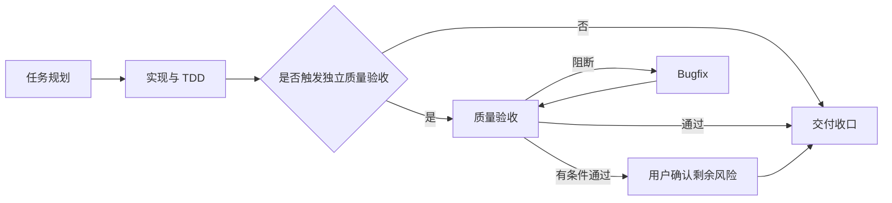

# 公司触发式质量验收设计

## 先看结论

新增 `company-quality-validation`，放在实现完成与交付收口之间。它不替代实现阶段 TDD，也不对所有任务强制执行；工作流按风险、任务跨度和交付粒度自动判定是否进入。

## 第一性原理

开发测试回答“这段实现是否按预期工作”，质量验收回答“集成后的交付物是否满足已确认需求并具备可交付证据”。两者验证对象不同，因此需要独立判定点，但不能把测试重复执行变成固定流程负担。

## 工作流位置

## 自动判定

- V0、V1：默认不触发；实现阶段证据足够时直接进入收口。
- 单任务 V2：默认不触发；涉及关键用户旅程、真实浏览器、API/数据库集成或明显回归面时触发。
- 多任务、跨模块、前后端/API/数据库联动的 V2：触发。
- 里程碑、版本交付和 V3：强制触发。
- 普通 bugfix：按回归影响面判定；hotfix 止血后的补偿链路强制触发。

## 职责边界

质量验收读取最小必要的需求、AC、业务规则、设计、任务状态和最终候选，不全量扫描项目文档。它建立 `AC -> 场景 -> 证据 -> 结果` 追溯矩阵，执行风险匹配的单元、集成、API、E2E、浏览器、权限、数据和非功能验证，并输出 `通过 / 有条件通过 / 阻断`。

质量验收默认不修改生产代码。发现实现缺陷时进入 `company-bugfix-runner`；发现需求或口径不明确时回到需求或设计；发现测试资产缺失时形成明确补测任务，不在验收阶段静默扩展实现范围。

## 能力组合

- 必须叠加 `superpowers:verification-before-completion`。
- 默认使用 `testing-qa` 专家能力。
- Web 关键路径按需增加 `e2e-testing-patterns` 和 `webapp-testing`。
- 复杂领域按需进入 `company-expert-routing`。
- 本阶段不默认叠加 TDD；缺陷修复回到 bugfix 后再执行 TDD/系统调试纪律。

## 产物

新增 `quality-validation-report-template.md`，包含结论、范围、验收路径图、AC 追溯矩阵、环境和数据、验证命令与证据、缺陷、未验证项、剩余风险和下一步。新建正式报告执行 `DOC-G01`、`DOC-G04` 至 `DOC-G12`。

## 对抗式审查

- 防止把所有 V2 都强制拉入新阶段。
- 防止“测试都绿”直接等价为需求验收通过。
- 防止验收失败后在本阶段顺手修改生产代码。
- 防止交付收口重复执行全部测试；收口复用新鲜证据，仅对最终候选和变更后风险补充验证。
- 防止用户必须记忆入口；workflow help、实现、bugfix 和收口自动给出判定与路由。

## 成功标准

- 中英文插件和 starter 都包含 skill、UI 入口、模板和索引。
- 自动路由明确区分跳过、触发和强制触发。
- 质量验收失败会回到 bugfix，成功后才进入交付收口。
- 安装校验覆盖 skill、模板、路由、版本和镜像一致性。
