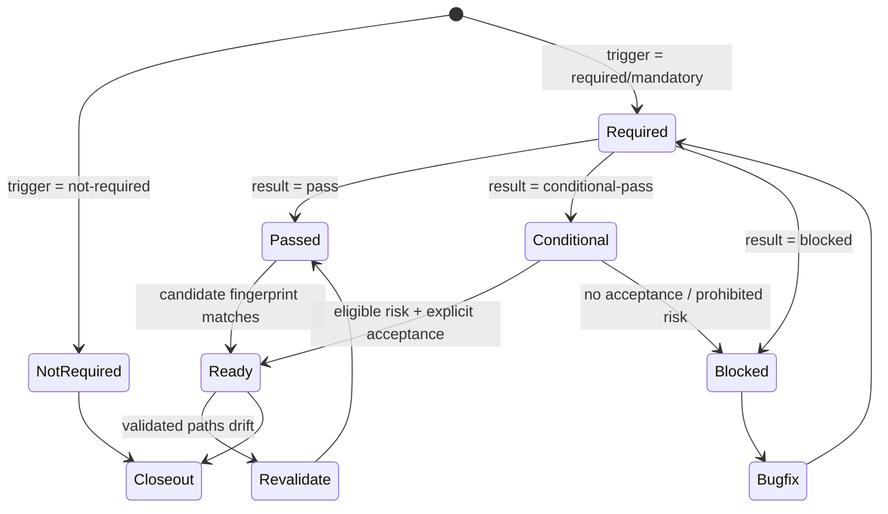

# 质量验收契约闭环设计

## 先看结论

在 `company-quality-validation` 与 `company-delivery-closeout` 之间增加一套轻量、可验证的 Markdown 状态交接契约。只在独立质量验收为 `需要/强制` 时持久化报告；`V0/V1` 和判定为不需要的单任务 `V2` 不新增文档。

## 第一性原理

交付收口需要证明的不是“历史上某次验收通过”，而是“当前准备提交的候选仍然是被验收的候选”。因此状态交接必须同时回答：报告在哪里、验收对象是谁、结论是什么、当前候选是否发生行为相关漂移。

## 持久化边界

- `不需要`：不强制创建质量验收报告；实现或 bugfix 完成报告保留判定依据，closeout 重新核对触发矩阵。
- `需要/强制`：必须创建 `quality-validation-report.md`，放在权威任务文档同级目录。
- 项目已有文件命名规范时可加既有编号前缀，但文件名必须保留 `quality-validation-report`，并在权威任务文档或当前 feature/version README 中记录路径。
- 报告是当前工作项的正式验收证据，不写入全局公共入口的当前状态，除非已进入集成分支。

## 候选身份

报告必须记录：

- 当前分支与 `HEAD` commit。
- 被验收的仓库相对路径清单。
- 对被验收路径执行 `git diff --binary HEAD -- <validated-paths>` 后得到的 SHA-256 指纹。
- 被验收范围内未跟踪文件的路径和逐文件 SHA-256。
- 验收时间、环境、数据和证据位置。

指纹只覆盖被验收的行为相关代码、测试、配置、迁移和资产。closeout 对文档规整或来源明确的临时文件清理不会自动使验收失效；被验收路径内容发生变化才触发重新验收。

## 状态机

## 条件通过红线

安全、权限、数据完整性、金额或指标公式、迁移、回滚或恢复风险不得条件通过。其他剩余风险只有在报告记录接受人、接受时间、接受范围、到期条件和补偿任务后才可进入 closeout。

## 路由契约

- 实现缺陷：`company-bugfix-runner`。
- 需求、业务规则或验收标准不清：`company-feature-requirements`。
- 架构、接口、数据或技术方案不清：`company-feature-design`。
- 缺少测试资产或修复任务授权：`company-feature-planning`。

## 能力透明度

对话完成报告继续输出完整透明度字段。持久化验收报告增加精简块：工作流层、透明度模式、Superpowers 叠加、实际调用、专家/插件能力、未调用但采用视角。它用于复盘执行能力，不替代 AC、证据和候选身份。

## Closeout 消费规则

1. 重新核对独立验收触发矩阵。
2. `不需要` 时使用实现阶段证据并继续。
3. `需要/强制` 时从权威任务文档同级或已登记路径读取报告。
4. 核对结论、条件接受记录和候选指纹。
5. 指纹一致时复用验收证据；只补充 cleanup、staging、secret、branch 和最终 diff 检查。
6. 被验收路径漂移时返回 `company-quality-validation`；不得用 closeout 内部全量测试替代重新验收。
7. closeout 只消费验收状态，不反向调用自身，也不让 quality-validation 执行 Git 收口。

## 验证职责分工

- quality-validation 中的 `verification-before-completion` 证明 AC、场景、证据和验收结论成立。
- delivery-closeout 中的 `verification-before-completion` 证明候选未漂移、清理和暂存边界正确、提交前状态可交付。
- closeout 默认复用新鲜证据，不无差别重跑完整测试集。

## 成功标准

- 中英文 skill、模板、closeout 和用户文档使用同一契约。
- 模板包含精简透明度、真实 workflow 路由、条件通过红线和候选身份。
- closeout 能区分不需要、缺报告、报告过期、条件未接受、候选漂移和验收通过。
- 回归测试覆盖契约字段、路由、状态转移、版本与安装校验。
- 不新增 JSON sidecar、CI 门禁或所有任务强制报告。
