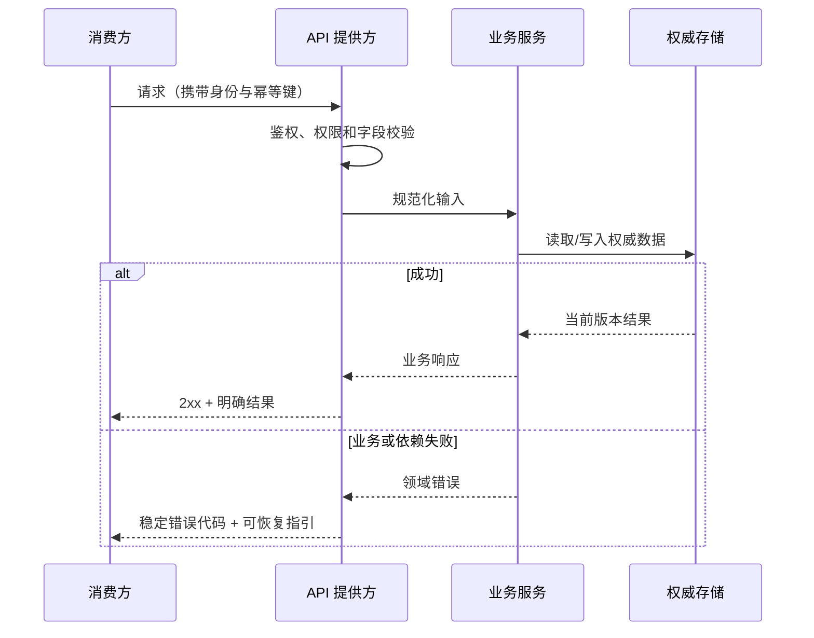

# API 契约

编写说明（成稿时移除）：先确定读者和用途，遵守 [回复与文档表达规范](human-output-standard.md)。内部调用、授权流水和详细候选指纹复用已有执行记录；确需新记录时参考 [执行记录模板](execution-record-template.md)。正文保留决策或操作所需技术规格与证据链接，删除无关占位项。

## 先看结论

- 本接口支持的用户/系统能力：
- 调用方和提供方：
- 成功结果：
- 最关键错误与兼容边界：
- 本次需要确认：

## 元信息

- 关联任务编号：
- 契约 ID：`API-001`
- 接口：
- 负责人：
- 状态：草稿 / 已确认 / 已变更
- 最后更新：
- 对比基线：初版，无对比基线 / 上一确认文档路径 + Git commit
- 提供方 / 消费方：
- 相关需求与设计：

## 本次变化

| 变更项 | 上一版 | 本版 | 变更原因 | 影响范围 |
| --- | --- | --- | --- | --- |
| 初版 | 无 | 建立 API 契约 | 首次确认 | 当前 work item |

## 建议阅读路径

- 业务/产品：先看结论、调用时序和错误时用户行为。
- 开发：继续看请求、响应、校验、兼容和安全。
- 测试：重点看错误矩阵、示例和契约验证。

## 调用时序

这张图回答：调用方如何经过鉴权、校验、业务处理和持久化获得结果？



关键结论：

- 身份、权限和输入校验在业务处理前完成。
- 错误代码保持稳定，消费方不得通过错误文案判断分支。
- 数据版本、幂等和兼容行为由契约明确，不由调用方猜测。

## 请求或输入

```json
{
  "requestId": "req-20260810-001",
  "projectId": 1001
}
```

| 字段 | 类型 | 必填 | 业务含义 | 校验规则 | 来源 |
| --- | --- | --- | --- | --- | --- |
| `requestId` | string | 是 | 幂等或追踪标识 | 长度和唯一性按契约 | 消费方生成 |

## 响应或输出

```json
{
  "code": "SUCCESS",
  "data": {
    "projectId": 1001,
    "status": "ACTIVE"
  }
}
```

| 字段 | 类型 | 可空 | 业务含义 | 来源/计算位置 |
| --- | --- | --- | --- | --- |
| `data.status` | string | 否 | 当前权威状态 | 业务服务 |

## 错误语义

| 条件 | HTTP/错误代码 | 响应语义 | 消费方行为 | 是否可重试 |
| --- | --- | --- | --- | --- |
| 无权限 | `403/FORBIDDEN` | 不暴露对象是否存在 | 提示无权限 | 否 |
| 版本冲突 | `409/VERSION_CONFLICT` | 当前状态已变化 | 刷新后重试 | 条件允许 |

## 兼容性与版本

- 是否向后兼容：
- 新增、废弃或重命名字段：
- 版本策略和兼容窗口：
- 消费方升级顺序：
- 幂等、分页、排序和时区：

## 安全、隐私与日志

- 鉴权和权限：
- 租户或数据隔离：
- 敏感字段和脱敏：
- 日志允许和禁止内容：
- 限流、超时和重放防护：

## 契约验证

| 测试 ID | 场景 | Provider 检查 | Consumer 检查 | Mock/fixture | 证据 |
| --- | --- | --- | --- | --- | --- |
| `TC-001` | 成功路径 |  |  |  |  |
| `TC-002` | 主要错误 |  |  |  |  |
| `TC-003` | 向后兼容 |  |  |  |  |

## 追溯

| 对象 | 完整引用 | 文档路径或章节 |
| --- | --- | --- |
| API | `<work-item-id>/API-001` | 本文 |
| AC | `<work-item-id>/AC-001` |  |
| 测试 | `<work-item-id>/TC-001` | 契约验证 |

## 图表豁免

默认不豁免。用户明确要求时记录用户、调用时序图和原因。


## 人工确认与下一步

- 提供方与消费方是否确认输入、输出、错误和兼容：否 / 是
- 仍然阻塞的契约问题：
- 推荐下一步：继续契约设计 / `company-feature-planning`
