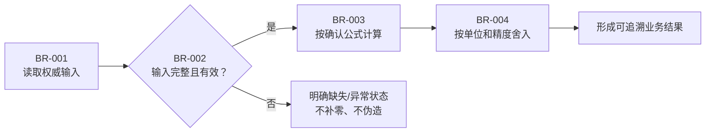

# 业务规则与计算口径

编写说明（成稿时移除）：先确定读者和用途，遵守 [回复与文档表达规范](human-output-standard.md)。内部调用、授权流水和详细候选指纹复用已有执行记录；确需新记录时参考 [执行记录模板](execution-record-template.md)。正文保留决策或操作所需技术规格与证据链接，删除无关占位项。

## 先看结论

- 本文规范的业务规则：
- 适用用户和场景：
- 关键状态或计算结果：
- 最容易误解的口径：
- 本次需要确认：

## 元信息

- 关联任务编号：
- 功能：
- 负责人：
- 状态：草稿 / 已确认 / 已变更
- 最后更新：
- 对比基线：初版，无对比基线 / 上一确认文档路径 + Git commit
- 关联需求与设计：

## 本次变化

| 变更项 | 上一版 | 本版 | 变更原因 | 影响范围 |
| --- | --- | --- | --- | --- |
| 初版 | 无 | 建立规则基线 | 首次确认 | 当前 work item |

## 建议阅读路径

- 业务/产品：结论、规则流程、公式解释和算例。
- 开发：字段来源、状态变化、精度、异常处理和权威边界。
- 测试：规则 ID、反例、边界值和验收映射。

## 适用范围与术语

| 术语/字段 | 含义 | 来源 | 单位 | 精度/格式 | 备注 |
| --- | --- | --- | --- | --- | --- |
|  |  |  |  |  |  |

## 规则与计算流程

这张图回答：输入如何经过规则判断、异常处理和计算形成业务结果？

关键结论：

- 输入先校验来源、时间范围、单位和完整性，再进入计算。
- 缺失或异常数据使用明确状态，不能默认为零或成功。
- 舍入只在规定步骤执行，前端不得改变权威计算口径。

## 操作逻辑

| 规则 ID | 场景 | 前置条件 | 操作/事件 | 系统响应 | 状态变化 | 异常处理 |
| --- | --- | --- | --- | --- | --- | --- |
| `BR-001` |  |  |  |  |  |  |

## 状态流转

- 初始状态：
- 允许状态与进入条件：
- 终态：
- 禁止流转：
- 冲突、重复和并发处理：

## 计算逻辑

### 公式 `BR-003`

- 自然语言：
- 数学表达：`result = input_a + input_b`
- 输入来源：
- 单位与币种：
- 精度和舍入：
- 缺失、异常和边界值：
- 计算位置：后端 / 数据加工层 / 其他权威组件

## 完整算例

| 输入 | 计算过程 | 预期输出 | 对应验收/测试 |
| --- | --- | --- | --- |
| `input_a=10`、`input_b=5` | `10 + 5` | `15` | `<work-item-id>/TC-001` |

## 对抗式场景

| 场景 | 风险 | 预期行为 | 对应测试 |
| --- | --- | --- | --- |
| 输入缺失 | 伪造结果 | 返回缺失状态，不补零 |  |
| 重复提交 | 重复计算或写入 | 幂等或明确冲突 |  |

## 未确认口径与决策

| 对象 | 当前处理 | 负责人 | 是否阻塞 | 确认结果 |
| --- | --- | --- | --- | --- |
|  |  |  |  |  |

## 追溯

| 对象 | 完整引用 | 文档路径或章节 |
| --- | --- | --- |
| 规则 | `<work-item-id>/BR-001` | 本文“操作逻辑” |
| 验收 | `<work-item-id>/AC-001` |  |
| 测试 | `<work-item-id>/TC-001` |  |

## 图表豁免

默认不豁免。用户明确要求时记录用户、规则/计算图和原因。

## 人工确认与下一步

- 操作逻辑、状态、公式、字段口径、异常和算例是否确认：否 / 是
- 仍然阻塞的口径：
- 推荐下一步：继续规则澄清 / `company-feature-design`
