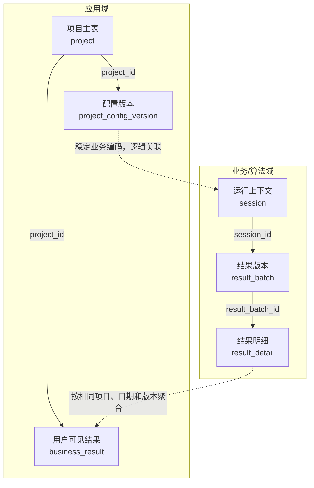
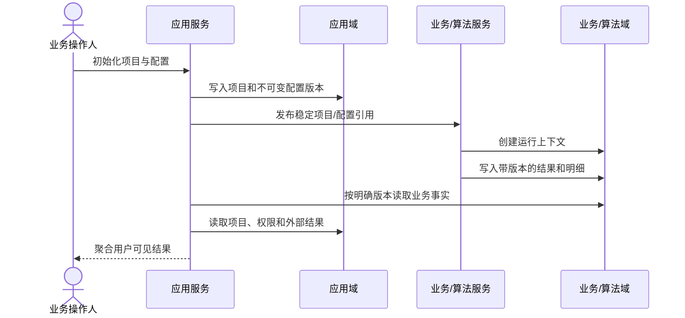

# 数据模型设计

编写说明（成稿时移除）：先确定读者和用途，遵守 [回复与文档表达规范](human-output-standard.md)。内部调用、授权流水和详细候选指纹复用已有执行记录；确需新记录时参考 [执行记录模板](execution-record-template.md)。正文保留决策或操作所需技术规格与证据链接，删除无关占位项。

## 先看结论

- 为什么需要这组表：
- 涉及表数量：新建 / 扩展 / 原样复用 / 逐步废弃
- 权威数据分别位于：
- 最重要的数据主链：
- 不可破坏的边界：
- 本次需要确认：

## 元信息

- 关联任务编号：
- 功能/里程碑：
- 负责人：
- 状态：草稿 / 已确认 / 已变更
- 复杂度：L1 / L2 / L3
- 最后更新：
- 对比基线：初版，无对比基线 / 上一确认文档路径 + Git commit
- 关联需求与技术设计：

## 本次变化

| 变更项 | 上一版 | 本版 | 变更原因 | 影响范围 |
| --- | --- | --- | --- | --- |
| 初版 | 无 | 建立数据模型基线 | 首次确认 | 当前 work item |

## 建议阅读路径与图例

- 业务/产品：先看结论、对象总览、关系总图、形成时序和页面取数。
- 开发：继续看读写矩阵、关联字段、单表设计、迁移与兼容。
- 测试：重点看不可破坏规则、缺失语义、并发约束和结构验收。
- 动作：新建 / 扩展 / 原样复用 / 逐步废弃。
- 线型：实线为同域物理或强一致关系；虚线为跨库、异步或逻辑映射。

## 数据对象总览

| 数据域 | 表 | 本次动作 | 权威职责 | 谁写入 | 谁读取 | 对应页面/流程 |
| --- | --- | --- | --- | --- | --- | --- |
|  |  |  |  |  |  |  |

## 表关系总图

这张图回答：权威对象如何关联、跨域链路在哪里汇合、哪些关系不能反向覆盖？



关键结论：

- 项目和配置是应用域权威，运行上下文和明细是业务域权威。
- 跨域使用稳定业务编码或显式映射，不建立无法维护的跨库物理外键。
- 两条链只在服务聚合层汇合，不能互相复制并冒充对方权威事实。

## 数据形成时序

这张图回答：数据从初始化到用户查询，分别由谁读取、校验和写入？



关键结论：

- 初始化先固定项目与配置，再创建运行上下文。
- 结果修正产生新版本，不原地覆盖已发布事实。
- 页面查询必须使用同一项目、日期、上下文和结果版本。

## 分步读写说明

| 步骤 | 触发条件 | 读取/校验 | 写入/更新 | 状态变化 | 不可破坏规则 |
| --- | --- | --- | --- | --- | --- |
| 1 |  |  |  |  |  |

## 关键关联字段

| 上游表 | 下游表 | 关联字段 | 关系类型 | 基数 | 完整性保证 | 说明 |
| --- | --- | --- | --- | --- | --- | --- |
|  |  |  | 物理外键 / 逻辑关联 / 版本关联 | 1:1 / 1:N / N:M | 唯一键 / 外键 / 事务 / 契约测试 |  |

## 单表完整设计

### 表 A：`table_name`（新建 / 扩展 / 复用 / 废弃）

**一句话用途：**

**权威边界：** 本表是什么的权威来源；明确不保存或不推断什么。

**读写职责：** 谁创建、谁修改、谁读取。

#### 字段定义

| 字段 | 类型 | 必填 | 状态 | 业务含义 | 来源/生成规则 |
| --- | --- | --- | --- | --- | --- |
| `id` | BIGINT | 是 | 现有 / 新增 / 规范 / 条件数据 | 主键 | 数据库生成 |

#### 约束与索引

| 类型 | 字段/表达式 | 目的 | 并发或异常保证 |
| --- | --- | --- | --- |
| 主键 | `id` | 稳定身份 |  |

#### 生命周期与异常语义

- 创建条件：
- 允许修改：
- 失效、归档或修正：
- 空值和缺失：
- 延迟和失败：
- 历史版本：

#### 脱敏示例记录（复杂表保留）

```json
{
  "id": 1001,
  "status": "ACTIVE",
  "version": 1
}
```

## 页面和接口取数映射

| 页面/API 内容 | 直接数据来源 | 聚合或计算位置 | 缺失时行为 | 权限边界 |
| --- | --- | --- | --- | --- |
|  |  |  | 隐藏 / 空状态 / 明确错误；不得伪造为 0 |  |

## 迁移、兼容与脚本

- 建表、改表、回填顺序：
- 双写和停止条件：
- 历史数据处理：
- 状态变更脚本版本目录：
- 执行前检查和执行后只读验证：
- 回滚、恢复与不可逆变化：
- 完整 SQL 脚本路径及 checksum：

## 第一性原理与对抗式审查

- 底层事实：
- 不可破坏约束：
- 最小成立条件：
- 重复提交、并发、版本冲突、缺失、延迟和异常值：
- 会推翻本模型的证据：

## 结构验收

| 验收 ID | 结构结论 | 验证方式 | 证据 |
| --- | --- | --- | --- |
| `TC-001` | 每个用户可见字段能追溯到权威来源 | 查询链检查 / 契约测试 |  |
| `TC-002` | 当前版本唯一且历史版本可保留 | 唯一约束 / 并发测试 |  |
| `TC-003` | 缺失数据不会被伪造为 0 或成功 | 集成测试 |  |

## L1/L2/L3 展开深度

- L1：可以合并相邻章节，但保留结论、关系图、字段、约束、读写逻辑和验收。
- L2：使用全部章节。
- L3：进一步展开跨域关系、迁移、并发、恢复、版本和一致性。

## 追溯

| 对象 | 完整引用 | 文档路径或章节 |
| --- | --- | --- |
| 需求 | `<work-item-id>/AC-001` |  |
| 设计决策 | `<work-item-id>/D-001` |  |
| 数据验证 | `<work-item-id>/TC-001` | 本文“结构验收” |

## 图表豁免

默认不豁免。关系图和形成时序图需要分别记录用户明确给出的豁免：

| 用户 | 豁免图表 | 原因 |
| --- | --- | --- |
|  |  |  |


## 人工确认与下一步

- 表职责、关系、版本和迁移是否确认：否 / 是
- 仍然阻塞的事项：
- 用户确认结果：
- 推荐下一步：继续数据设计 / 返回技术设计 / `company-feature-planning`
