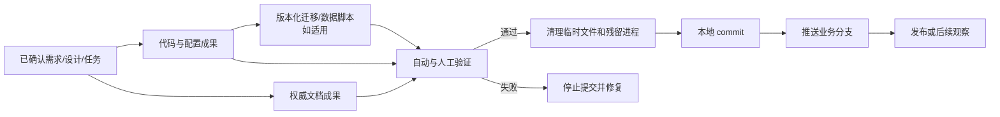

# 交付收口报告

## 先看结论

- 本次实际交付的用户可见结果：
- 代码、文档、脚本和配置成果：
- 验证等级与结果：
- 已知剩余风险：
- 本次需要确认：提交 / 推送 / 暂不发布
- 集成处置：正式交付 / 有条件合入且未交付

API 不可用且仅有条件合入时，必须原样表达以下事实：**本次合入不代表功能正式交付**。当前只先合并了业务分支，真实 API 联调和真实页面验收尚未完成。

## 元信息

- work-item-id：
- 功能/任务批次/里程碑：
- 负责人：
- 状态：待收口 / 已验证 / 已提交 / 已推送
- 最后更新：
- 对比基线：初版，无对比基线 / 上一次收口报告 + Git commit
- 业务分支：

## API 不可用时的条件合入记录

- 当前状态：不适用 / `FIXTURE_READY` / `API_PENDING` / `CONDITIONAL_MERGED`
- API 不可用证据、时间与影响：
- 批准人：
- 批准时间：
- 源候选与候选指纹：
- 目标业务分支：
- 批准范围与原因：
- 到期条件：
- 补偿任务：
- 是否确认未发布、未部署、未关闭 API 联调任务：否 / 是
- 生产路径无 Fixture/Mock 静默回退证据：

客户告知：当前仅完成基于 Fixture 的前端开发，并经批准先合入上述业务分支。由于 API 不可用，尚未完成真实 API 联调和真实页面验收；当前状态为“有条件合入 / 未交付”，不能证明真实数据、图表或业务计算正确。

## 本次变化

| 变更项 | 交付前 | 交付后 | 原因 | 影响范围 |
| --- | --- | --- | --- | --- |
|  |  |  |  |  |

## 建议阅读路径

- 业务/产品：结论、交付成果、剩余风险和发布状态。
- 开发：成果关系、清理、验证、commit 和 push。
- 测试/运维：验证证据、迁移、发布、回退和观察。

## 成果关系与发布流程

这张图回答：需求、代码、文档、脚本和验证如何组成一次可提交、可发布、可恢复的交付？

关键结论：

- 文档、代码和版本化脚本共同构成交付，不以“能运行”替代完整性。
- 验证失败时不得提交完成结论。
- 临时文件、浏览器进程和本地服务在 commit 前按边界清理。

## 交付成果清单

| 成果 | 类型 | 路径 | 对应任务/AC | 状态 | 说明 |
| --- | --- | --- | --- | --- | --- |
|  | 代码 / 文档 / 配置 / 脚本 / 数据迁移 |  |  | 完成 / 未完成 / 不适用 |  |

## 清理与仓库检查

- 临时文件、生成物和调试代码：
- 本地服务、Playwright/浏览器和残留进程：
- `git status` 中用户既有改动：
- 本次变更范围和异常大文件：
- 版本化数据库脚本、checksum 和执行边界：

## 验证证据

| 测试 ID | 命令/步骤 | 预期结果 | 实际结果 | 证据 |
| --- | --- | --- | --- | --- |
| `TC-001` |  |  |  |  |

## 发布、提交与恢复

- Commit：
- Push 分支与远程：
- 数据库/配置/基础设施执行状态：仓库已生成 / 环境已执行 / 未执行
- 发布或部署状态：
- 回退和恢复：
- 观察窗口与指标：

## 遗留事项与旁支

| 事项 | 是否在当前范围 | 风险 | 所有者 | 后续入口 |
| --- | --- | --- | --- | --- |
|  | 否 / 是 |  |  |  |

## 追溯

| 对象 | 完整引用 | 文档路径或章节 |
| --- | --- | --- |
| 任务 | `<work-item-id>/T-001` |  |
| 验证 | `<work-item-id>/TC-001` | 验证证据 |

## 图表豁免

默认不豁免。用户明确要求时记录用户、成果关系/发布图和原因。

## 人类可读性检查

| 门禁 | 结果 | 证据或说明 |
| --- | --- | --- |
| `DOC-G01`、`DOC-G04` | 通过 / 豁免 / 阻断 |  |
| `DOC-G05` 至 `DOC-G12` | 通过 / 阻断 |  |

## 人工确认与下一步

- 是否允许本地 commit：否 / 是
- 是否允许 push 当前业务分支：否 / 是
- 收口状态：未完成 / 已完成
- 推荐下一步：修复阻断 / 提交 / 推送 / 发布观察
