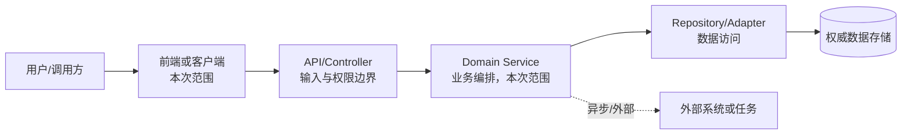
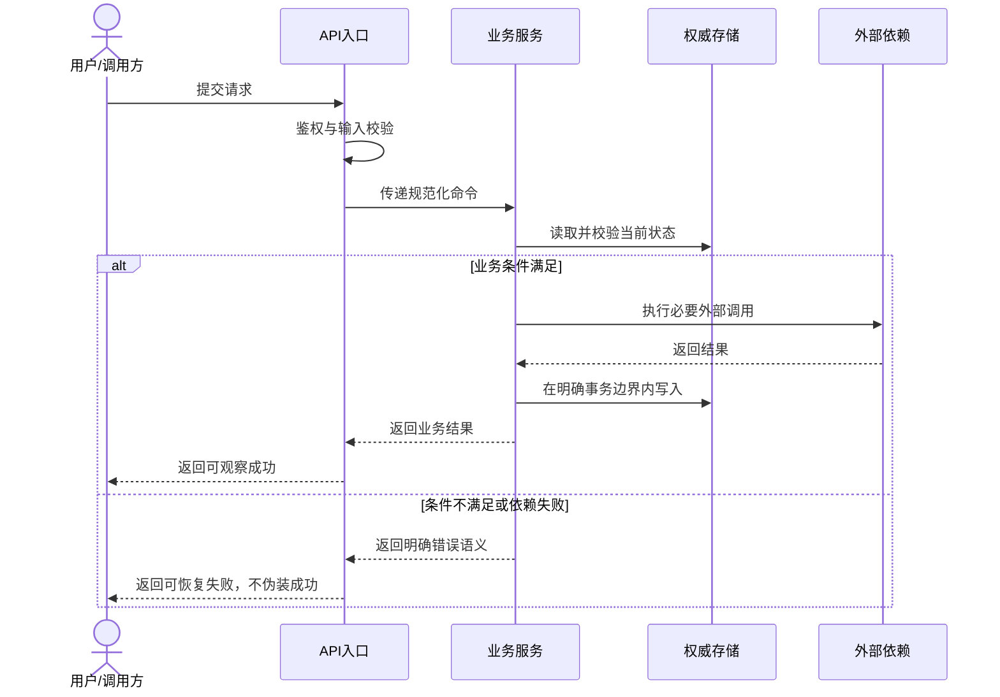

# 技术设计

## 先看结论

- 推荐方案：
- 解决的需求/AC：
- 涉及的系统、模块和数据：
- 最关键的设计决策：
- 主要代价与风险：
- 本次需要用户确认：

## 元信息

- work-item-id：
- 功能：
- 负责人：
- 状态：草稿 / 已确认 / 已变更
- 复杂度：L1 / L2 / L3
- 最后更新：
- 对比基线：初版，无对比基线 / 上一确认文档路径 + Git commit
- 需求与业务规则：

## 本次变化

| 变更项 | 上一版 | 本版 | 变更原因 | 影响范围 |
| --- | --- | --- | --- | --- |
| 初版 | 无 | 建立技术设计基线 | 首次确认 | 当前 work item |

## 建议阅读路径

- 业务/产品：先看结论、架构图、核心时序和用户确认点。
- 开发：继续看模块边界、数据/API、资产落点和发布恢复。
- 测试：重点看需求追溯、异常时序、测试策略和验证停点。
- 图例：实线为同步调用；虚线为异步、事件或逻辑关系；带“本次”标签的节点为变更范围。

## 需求、规则与 AC 追溯

| 完整引用 | 需求/规则结论 | 技术承载位置 | 验证方式 |
| --- | --- | --- | --- |
| `<work-item-id>/AC-001` |  |  | `<work-item-id>/TC-001` |

## 目标使用终端与适配边界

| 使用终端 | 需求状态 | 技术承载 | 页面/代码/API 共用策略 | 视口、输入与能力差异 | 明确不做 |
| --- | --- | --- | --- | --- | --- |
| PC Web | 支持 / 继承 / 不支持 |  |  |  |  |
| 移动 Web | 支持 / 继承 / 不支持 |  |  |  |  |
| iOS/Android App | 支持 / 继承 / 不支持 |  |  |  |  |
| 桌面客户端 | 支持 / 继承 / 不支持 |  |  |  |  |
| 大屏 | 支持 / 继承 / 不支持 |  |  |  |  |

- 设计只能承载需求已确认的终端。未明确列为支持的终端不得自行适配。
- 明确说明共用的是 API、业务逻辑还是 UI；不要因为共用代码就默认承诺响应式或触摸体验。
- 无直接终端差异时写明原因，并保持现有接口兼容即可。

## 总体技术架构

这张图回答：调用方、应用模块、数据和外部依赖如何协作，本次改动落在哪里？

关键结论：

- 调用入口只负责输入、权限和错误协议，不重新定义业务规则。
- Domain Service 承载本次编排，权威数据通过 Repository/Adapter 访问。
- 外部调用与本地事务边界必须分开说明，失败不能造成伪成功。

## 模块职责与边界

| 模块 | 职责 | 明确不负责 | 输入 | 输出 | 依赖 | 本次动作 |
| --- | --- | --- | --- | --- | --- | --- |
|  |  |  |  |  |  | 新建 / 修改 / 复用 |

## 核心调用时序

这张图回答：一次核心请求如何完成校验、处理、持久化和响应？

关键结论：

- 鉴权和输入校验发生在入口，业务条件由业务服务判断。
- 数据写入与外部调用顺序必须匹配幂等、补偿和一致性策略。
- 失败路径返回可识别错误，必要时保留重试或人工恢复依据。

## 关键异常时序与失败语义

| 失败点 | 触发条件 | 对外行为 | 数据状态 | 重试/补偿 | 监控证据 |
| --- | --- | --- | --- | --- | --- |
|  |  |  |  |  |  |

## 数据模型与状态设计

- 是否涉及表结构：否 / 是；是则链接 `data-model.md` 或 `data-model-template.md` 产物。
- 权威数据来源：
- 状态机和禁止流转：
- 版本、缓存和一致性：
- 缺失、延迟和历史数据语义：

## 方案对比与决策

| 决策 ID | 方案 | 核心思路 | 优点 | 代价/风险 | 适用条件 | 结论 |
| --- | --- | --- | --- | --- | --- | --- |
| `D-001` | 推荐方案 |  |  |  |  | 推荐 |
|  | 备选方案 A |  |  |  |  | 不选 |

- 不选其他方案的原因：
- 会推翻当前选择的新证据：
- 用户确认结果：

## API 与模块契约

| 契约 ID | 提供方 | 消费方 | 输入 | 输出 | 错误语义 | 兼容策略 | 权威文档 |
| --- | --- | --- | --- | --- | --- | --- | --- |
| `API-001` |  |  |  |  |  |  |  |

跨前后端、服务或外部系统边界时，使用 `api-contract-template.md`。

## 权限、性能与运行质量

- 鉴权、角色与数据隔离：
- 性能预算、容量和超时：
- 缓存、并发与幂等：
- 日志、指标、链路和告警：
- 隐私与敏感数据：
- 降级、重试、补偿和熔断：

## 资产归属与实现映射

| 产物 | 资产类型 | 所属工程/模块 | 仓库相对完整路径 | 新建/修改 | 落点依据 | 验证者 |
| --- | --- | --- | --- | --- | --- | --- |
|  |  |  |  |  | manifest / 构建或测试配置 / 项目惯例 |  |

- 边界配置：`.codex-workflow/asset-boundaries.json`
- 显式例外及所有者、验证方式：

## 测试策略

| 测试 ID | 对应需求/时序节点 | 层级 | 验证内容 | 失败判定 | 证据 |
| --- | --- | --- | --- | --- | --- |
| `TC-001` | `<work-item-id>/AC-001` | 单元 / 集成 / 契约 / E2E |  |  |  |

## 发布、迁移与恢复

- 部署顺序：
- 数据或配置迁移：
- 兼容窗口：
- 功能开关：
- 回滚条件和操作：
- 不可逆变化：
- 发布后观察指标：

## 第一性原理与对抗式审查

- 底层事实：
- 不可破坏约束：
- 最小成立条件：
- 关键反例、极端输入、并发和失败场景：
- 会推翻本方案的证据：

## 追溯

| 对象 | 完整引用 | 文档路径或章节 |
| --- | --- | --- |
| 设计决策 | `<work-item-id>/D-001` | 本文“方案对比与决策” |
| API | `<work-item-id>/API-001` |  |
| 测试 | `<work-item-id>/TC-001` | 本文“测试策略” |
| 后续任务 |  |  |

## 图表豁免

默认不豁免。架构图和时序图需要分别记录用户明确给出的豁免：

| 用户 | 豁免图表 | 原因 |
| --- | --- | --- |
|  |  |  |

## 人类可读性检查

| 门禁 | 结果 | 证据或说明 |
| --- | --- | --- |
| `DOC-G01` | 通过 / 阻断 |  |
| `DOC-G03` | 通过 / 豁免 / 阻断 |  |
| `DOC-G04` | 不触发 / 通过 / 豁免 / 阻断 |  |
| `DOC-G05` 至 `DOC-G12` | 通过 / 阻断 |  |

## 人工确认与下一步

- 当前设计是否达到可拆解状态：否 / 是
- 实现授权状态：未授权 / 已失效 / 待用户确认
- 仍需确认的接口、数据或风险：
- 用户对推荐方案的确认：
- 推荐下一步：继续设计 / `company-feature-planning`
- 阶段边界：未经用户明确授权，不进入任务拆解或编码。
