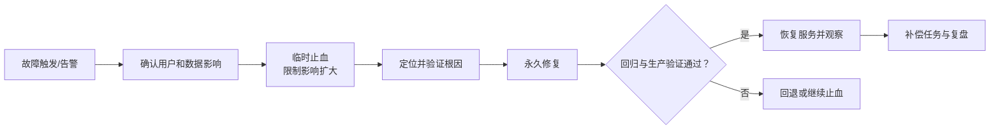

# Hotfix 报告

## 先看结论

- 故障和用户影响：
- 当前状态：
- 临时止血：
- 根因与永久修复：
- 本次需要确认：

## 元信息

- work-item-id：
- 事件/Hotfix：
- 负责人：
- 严重级别：
- 状态：处理中 / 已止血 / 已恢复 / 已关闭
- 时间线：
- 对比基线：初版，无对比基线 / 上一确认文档路径 + Git commit

## 本次变化

| 变更项 | 上一版 | 本版 | 变更原因 | 影响范围 |
| --- | --- | --- | --- | --- |
| 初版 | 无 | 建立事件记录 | Hotfix 启动 | 当前事件 |

## 建议阅读路径

- 业务/管理：影响、当前状态、恢复和剩余风险。
- 开发：故障链、根因、止血与永久修复边界。
- 测试/运维：验证、监控、回退和补偿任务。

## 故障与恢复路径

这张图回答：故障如何被发现、止血、修复、验证并恢复服务？

关键结论：

- 止血只控制影响，不得被描述为永久修复。
- 根因必须有复现或证据链，不能只根据最后一个报错猜测。
- 恢复需要验证和观察；失败时执行明确回退。

## 影响与时间线

| 时间 | 事件 | 用户/数据影响 | 证据 |
| --- | --- | --- | --- |
|  |  |  |  |

## 根因与修复边界

- 直接原因：
- 根本原因：
- 为什么原验证没有发现：
- 临时止血内容与到期条件：
- 永久修复内容：
- 明确未修改范围：

## 变更与验证

| 测试 ID | 检查 | 命令/步骤 | 预期结果 | 证据 |
| --- | --- | --- | --- | --- |
| `TC-001` | 最小复现 |  | 修复前失败、修复后通过 |  |
| `TC-002` | 回归 |  | 受影响主链正常 |  |
| `TC-003` | 恢复观察 |  | 指标和错误率恢复 |  |

## 发布、回退与补偿

- 发布方式和授权：
- 回退条件与步骤：
- 数据恢复或补偿：
- 观察窗口和指标：
- 后续需求、设计、测试或监控任务：

## 追溯

| 对象 | 完整引用 | 文档路径或章节 |
| --- | --- | --- |
| 修复任务 | `<work-item-id>/T-001` |  |
| 验证 | `<work-item-id>/TC-001` | 变更与验证 |

## 图表豁免

默认不豁免。用户明确要求时记录用户、故障与恢复图和原因。

## 人类可读性检查

| 门禁 | 结果 | 证据或说明 |
| --- | --- | --- |
| `DOC-G01`、`DOC-G04` | 通过 / 豁免 / 阻断 |  |
| `DOC-G05` 至 `DOC-G12` | 通过 / 阻断 |  |

## 人工确认与下一步

- 是否恢复并完成观察：否 / 是
- 剩余风险和补偿任务：
- 是否可以关闭事件：否 / 是
