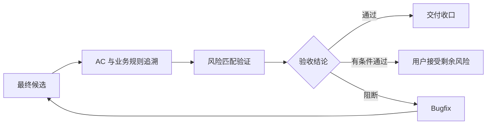

# 质量验收报告

编写说明（成稿时移除）：先确定读者和用途，遵守 [回复与文档表达规范](human-output-standard.md)。内部调用、授权流水和详细候选指纹复用已有执行记录；确需新记录时参考 [执行记录模板](execution-record-template.md)。正文保留决策或操作所需技术规格与证据链接，删除无关占位项。 标题和章节顺序可调整；初稿不必保留变更表，版本变更评审仍须说明基线、变化及影响。图表按 [文档标准](document-standard.md) 的文种与内容要求选择，既有验收和证据条件不变。

## 先看结论

- 验收结论：通过 / 有条件通过 / 阻断
- 用户可获得的最终结果：
- 主要证据：
- 未验证项和影响：
- 下一步：进入交付收口 / 用户确认条件 / 进入 bugfix / 返回需求或设计

## 元信息

- 关联任务编号：
- 验收范围：任务批次 / 功能 / 里程碑 / 版本 / hotfix 补偿
- 正式报告路径：权威任务文档同级目录下的 `quality-validation-report.md` 或带项目编号前缀的等价路径
- 独立质量验收：不需要 / 需要 / 强制
- 验收负责人：
- 验收时间：
- 对比基线：初版，无对比基线 / 上一确认文档路径 + Git commit

## 验收版本与证据

- 候选版本与验收时间：
- 范围及版本对应的证据链接：链接实际内部记录中的 HEAD、diff SHA-256、被验收路径及未跟踪文件校验值；不得仅链接空模板。

## 本次变化

| 变更项 | 上一版 | 本版 | 原因 | 影响范围 |
| --- | --- | --- | --- | --- |
| 初版 | 无 | 建立独立质量验收基线 | 实现完成 | 当前 work item |

## 验收路径

关键结论：验收失败回到修复或文档阶段，修复后重新验证同一范围；不得在本阶段修改生产代码。

## 验收范围与依据

- 权威需求和 AC：
- 业务规则与计算口径：
- 技术设计、API 和数据契约：
- 已完成任务：
- 明确排除项：

## AC 追溯矩阵

| AC/规则 ID | 用户场景 | 验证类型 | 命令或步骤 | 证据 | 结果 |
| --- | --- | --- | --- | --- | --- |
| `<work-item-id>/AC-001` |  | 单元 / 集成 / API / E2E / 浏览器 / 手工 |  |  | 通过 / 失败 / 未验证 |

## 环境和数据

| 项目 | 值 | 与目标环境差异 | 风险 |
| --- | --- | --- | --- |
| 应用版本、依赖、浏览器、数据库、测试数据 |  |  |  |

## 数据源与真实 API 门禁

- 当前状态：`FIXTURE_READY` / `API_PENDING` / `CONDITIONAL_MERGED` / `API_INTEGRATED` / `QUALITY_PASS`
- 本次证据数据源：Fixture / Mock / 真实 API / 混合
- 真实 API、环境、数据范围和候选指纹：
- 生产路径无 Fixture/Mock 静默回退证据：
- API 不可用：否 / 是；原因、时间和影响：
- 真实 API 联调与真实页面验收：未完成 / 已完成

需要真实 API 但当前为 `API_PENDING` 时，验收结论必须为阻断。即使用户批准 `CONDITIONAL_MERGED`，也不能改写为有条件通过，且不得证明真实数据、图表或业务计算正确。

如已批准有条件合入，记录但不改变验收结论：

- 批准人：
- 批准时间：
- 目标业务分支：
- 到期条件：
- 补偿任务：

## 验证证据

| 类别 | 命令或步骤 | 结果 | 证据位置 | 新鲜度 |
| --- | --- | --- | --- | --- |
| 测试 / 类型 / 构建 / API / 浏览器 / 性能 / 恢复 |  |  |  | 当前最终候选 / 可复用 |

## 对抗式审查

| 风险 | 异常或边界场景 | 预期 | 实际 | 结论 |
| --- | --- | --- | --- | --- |
| 权限 / 并发 / 数据 / 性能 / 兼容 / 渲染 |  |  |  |  |

## 缺陷与回路

| 缺陷 ID | 严重度 | 证据 | 路由 | 修复后重验范围 | 状态 |
| --- | --- | --- | --- | --- | --- |
|  |  |  | `company-bugfix-runner` / `company-feature-requirements` / `company-feature-design` / `company-feature-planning` |  |  |

## 未验证项与剩余风险

| 项目 | 原因 | 影响 | 是否允许有条件通过 | 用户接受记录或后续条件 |
| --- | --- | --- | --- | --- |
|  |  |  | 是 / 否 |  |

有条件通过硬约束：安全、权限、数据完整性、金额或指标公式、迁移、回滚或恢复风险不得有条件通过。

仅对允许的剩余风险填写：

- 接受人：
- 接受时间：
- 接受范围：
- 到期条件：
- 补偿任务：

## 图表豁免

默认不豁免。只有用户明确说明不需要图表时，记录用户、范围和原因。

## 人工确认与下一步

- 验收结论已确认：否 / 是
- 有条件通过风险已由用户接受：不适用 / 否 / 是
- 交付收口就绪：未就绪 / 就绪
- 下一步责任方与动作（成稿时用中文描述）：`company-bugfix-runner` / `company-feature-requirements` / `company-feature-design` / `company-feature-planning` / `company-delivery-closeout`
