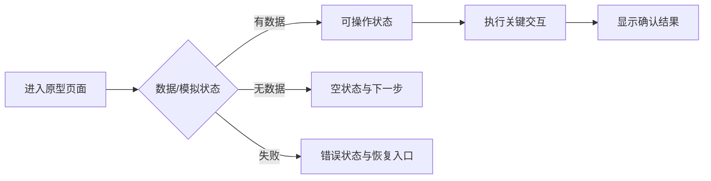

# 需求原型验证记录

## 元信息

- work-item-id：
- 原型功能：
- 负责人：
- 状态：草稿迭代 / 待确认 / 已确认 / 已撤回
- 最后更新：
- 对比基线：初版，无对比基线 / 上一确认原型记录 + Git commit
- 权威需求文档：

## 先看结论

- 原型要验证的需求问题：
- 用户确认的页面、交互或状态：
- 原型未承诺内容：
- 是否可以转为需求基线：
- 本次需要确认：

## 本次变化

| 变更项 | 上一版 | 本版 | 用户反馈/原因 | 影响的需求或 AC |
| --- | --- | --- | --- | --- |
| 初版 | 无 | 建立原型验证记录 | 开始迭代 | 当前 work item |

## 建议阅读路径

- 业务/产品：结论、页面状态图、验证清单和未承诺内容。
- 设计/开发：只将已确认内容回写需求，不把原型技术实现当生产方案。
- 测试：关注状态、交互和 AC 证据。

## 页面状态与交互流程

这张图回答：用户如何进入原型、完成关键交互，并看到成功、空数据或失败状态？

关键结论：

- 原型覆盖正常、空数据和失败状态，而不只展示理想截图。
- 所有交互结论必须回到需求流程、规则或 AC。
- 原型不验证真实 API、数据库、认证、生产数据或性能。

## 验证清单与证据

| 验证 ID | 页面/交互/状态 | 用户反馈 | 需求变化 | 证据路径 |
| --- | --- | --- | --- | --- |
| `TC-001` |  |  |  |  |

## 原型范围与边界

- 草稿路径：`.codex-workflow/prototypes/<feature>/draft/`
- 确认基线路径：
- 使用的模拟数据和假设：
- 未连接的真实系统：
- 原型代码是否保留及清理方式：

## 转为需求基线

- 已回写的需求流程、规则、AC 和文案：
- 未采纳反馈及原因：
- 确认日期、确认人和 SHA-256：
- 是否明确授权进入技术设计：否 / 是（原型确认本身不构成授权）

## 追溯

| 对象 | 完整引用 | 文档路径或章节 |
| --- | --- | --- |
| 需求流程 | `<work-item-id>/F-001` |  |
| 验收 | `<work-item-id>/AC-001` |  |
| 原型验证 | `<work-item-id>/TC-001` | 验证清单与证据 |

## 图表豁免

默认不豁免。用户明确要求时记录用户、页面状态/交互图和原因。

## 人类可读性检查

| 门禁 | 结果 | 证据或说明 |
| --- | --- | --- |
| `DOC-G01`、`DOC-G04` | 通过 / 豁免 / 阻断 |  |
| `DOC-G05` 至 `DOC-G12` | 通过 / 阻断 |  |

## 人工确认与下一步

- 原型结论：继续迭代 / 转需求基线 / 撤回
- 推荐下一步：`company-feature-requirements` / 等待用户明确授权设计
