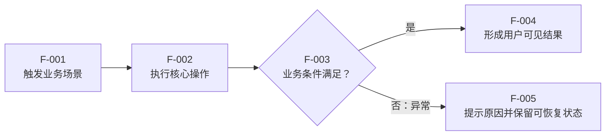

# 功能需求

## 先看结论

- 用户问题：
- 需求结论：
- 用户可见结果：
- 影响的角色、页面或流程：
- 本次需要确认：

## 元信息

- work-item-id：
- 功能：
- 负责人：
- 状态：草稿 / 已确认 / 已变更
- 复杂度：L1 / L2 / L3
- 最后更新：
- 对比基线：初版，无对比基线 / 上一确认文档路径 + Git commit
- 相关讨论或工单：

## 本次变化

| 变更项 | 上一版 | 本版 | 变更原因 | 影响范围 |
| --- | --- | --- | --- | --- |
| 初版 | 无 | 建立需求基线 | 首次确认 | 当前 work item |

## 建议阅读路径

- 业务/产品：先看结论、用户场景、业务流程、范围和待确认事项。
- 开发：再看操作步骤、规则、AC 和追溯。
- 测试：重点看主流程、异常路径、AC 和边界条件。
- 图例：实线表示正常路径；带“异常”标签的连线表示失败、退出或人工处理路径。

## 用户、场景与价值

| 用户/角色 | 当前问题 | 使用场景 | 目标结果 | 成功指标 |
| --- | --- | --- | --- | --- |
|  |  |  |  |  |

## 目标使用终端与适配边界

这里的“终端”是 PC Web、移动 Web、App、桌面客户端或大屏等用户使用形态，不是网络端口。优先继承 `specs/global/INDEX.md` 的项目基线；本功能存在例外时明确写出。

| 使用终端 | 状态：支持/继承/延期/不支持 | 是否共用页面/代码/API | 视口、浏览器与输入方式 | 响应式/触摸要求 | 对应 AC |
| --- | --- | --- | --- | --- | --- |
| PC Web |  |  |  |  |  |
| 移动 Web |  |  |  |  |  |
| iOS/Android App |  |  |  |  |  |
| 桌面客户端 |  |  |  |  |  |
| 大屏 |  |  |  |  |  |

- 未明确列为支持的终端不得自行适配，也不得增加对应交互、截图、浏览器矩阵或 E2E 范围。
- PC-only 功能应写明最小视口、支持浏览器和鼠标/键盘要求；移动端只有明确支持时才要求响应式、触摸和移动视口验证。
- 无直接页面或终端差异时写“无直接终端差异”，不要机械制造多端需求。

## 目标业务流程

这张图回答：用户从触发需求到获得结果，主流程和关键异常怎样发生？

关键结论：

- 主流程从 `F-001` 进入并在 `F-004` 形成可观察结果。
- `F-003` 是业务判断点，不能由前端或实现代码自行改变口径。
- 异常路径进入 `F-005`，不得伪装成成功或静默丢失。

## 操作步骤与系统反馈

| 流程节点 | 前置条件 | 用户操作/业务事件 | 系统响应 | 数据或状态变化 | 异常处理 |
| --- | --- | --- | --- | --- | --- |
| `F-001` |  |  |  |  |  |
| `F-002` |  |  |  |  |  |
| `F-003` |  |  |  |  |  |

## 页面与交互状态

| 页面/区域 | 进入条件 | 用户可见内容 | 可执行操作 | 加载/空数据/失败/无权限状态 |
| --- | --- | --- | --- | --- |
|  |  |  |  |  |

无页面需求时写明“本功能无直接页面”，并说明用户从哪个接口、任务或业务结果感知变化。

## 范围与边界

### 范围内

- 填写本次承诺交付的内容。

### 范围外

- 填写不属于本需求的内容。

### 本期明确不做

- 填写已讨论但本期不实现的内容。

### 外部依赖与现有功能关系

- 填写依赖系统、团队、数据或既有功能。

## 业务规则与计算口径

| 规则 ID | 规则结论 | 对应流程节点 | 异常行为 | 权威文档/章节 |
| --- | --- | --- | --- | --- |
| `BR-001` |  | `F-003` |  |  |

业务规则文档判定：需要 / 不需要。涉及公式、金额、指标、状态机、角色差异、字段口径、异常值或复杂操作时，使用 `business-rules-template.md`。

## 验收标准

| AC | 对应流程节点 | Given | When | Then | 反例/异常 |
| --- | --- | --- | --- | --- | --- |
| `AC-001` | `F-001` 至 `F-004` |  |  |  |  |

## 假设、待确认问题与已确认决策

### 假设

| 假设 | 为什么暂时可接受 | 如何验证 |
| --- | --- | --- |
|  |  |  |

### 待确认问题

| 问题 | 负责人 | 是否阻塞 | 需要确认的时间点 |
| --- | --- | --- | --- |
|  |  |  |  |

### 已确认决策

| 决策 ID | 结论 | 原因 | 确认人/日期 |
| --- | --- | --- | --- |
| `D-001` |  |  |  |

## 需求原型与实物证据

- 是否触发需求原型：否 / 草稿迭代 / 待确认 / 已确认 / 已撤回
- 验证目标：
- 草稿或基线路径：
- 已验证页面、交互、状态和文案：
- 原型未承诺内容：
- 用户反馈如何回写需求：
- 确认日期与 SHA-256：

## 追溯

| 对象 | 完整引用 | 文档路径或章节 |
| --- | --- | --- |
| 流程 | `<work-item-id>/F-001` | 本文“目标业务流程” |
| 验收 | `<work-item-id>/AC-001` | 本文“验收标准” |
| 后续设计 |  |  |
| 任务计划 |  |  |
| 验证证据 |  |  |

## 图表豁免

默认不豁免。只有用户明确要求时填写：

- 用户：
- 豁免图表：
- 原因：

## 人类可读性检查

| 门禁 | 结果 | 证据或说明 |
| --- | --- | --- |
| `DOC-G01` | 通过 / 阻断 |  |
| `DOC-G02` | 通过 / 豁免 / 阻断 |  |
| `DOC-G05` 至 `DOC-G12` | 通过 / 阻断 |  |

## 人工确认与下一步

- 当前需求是否达到可设计状态：否 / 是
- 仍然阻塞的事项：
- 用户确认结果：
- 推荐下一步：继续需求 / `company-requirements-prototype` / `company-feature-design`
- 阶段边界：未经用户明确授权，不进入技术设计、任务拆解或编码。
