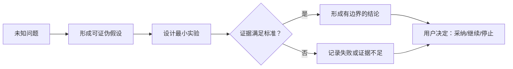

# Spike 验证报告

## 元信息

- work-item-id：
- Spike：
- 负责人：
- 时间盒：
- 状态：进行中 / 已结束 / 已转正式工作
- 最后更新：
- 对比基线：初版，无对比基线 / 上一确认文档路径 + Git commit

## 先看结论

- 要降低的不确定性：
- 验证结论：可行 / 有条件可行 / 不可行 / 证据不足
- 最关键证据：
- 适用边界：
- 本次需要确认：

## 本次变化

| 变更项 | 上一版 | 本版 | 变更原因 | 影响范围 |
| --- | --- | --- | --- | --- |
| 初版 | 无 | 建立 Spike 记录 | 开始验证 | 当前 Spike |

## 建议阅读路径

- 决策者：结论、证据、适用边界和建议。
- 开发：假设、实验环境、步骤和技术限制。
- 测试：成功/失败标准、原始证据和未验证项。

## 验证路径

这张图回答：未知问题如何通过假设、实验和证据形成可复核结论？

关键结论：

- Spike 只验证明确假设，不顺势实现完整生产功能。
- 结论必须能回到命令、数据、截图或日志。
- 实验可行不等于生产可用，适用边界必须单独说明。

## 问题、假设与判定标准

| 假设 ID | 可证伪假设 | 成功标准 | 失败标准 | 时间盒 |
| --- | --- | --- | --- | --- |
| `D-001` |  |  |  |  |

## 实验环境与步骤

- 代码/版本/commit：
- 环境、配置和数据：
- 执行步骤与命令：
- 临时文件位置和清理方式：

## 证据

| 实验 | 观察结果 | 原始证据路径 | 是否可复现 | 限制 |
| --- | --- | --- | --- | --- |
|  |  |  |  |  |

## 结论、风险与建议

- 结论及置信度：
- 适用和不适用范围：
- 生产化仍需解决：
- 推荐：进入需求/设计 / 继续 Spike / 停止
- Spike 代码和原型是否保留：

## 追溯

| 对象 | 完整引用 | 文档路径或章节 |
| --- | --- | --- |
| 假设/决策 | `<work-item-id>/D-001` | 问题、假设与判定标准 |
| 后续正式文档 |  |  |

## 图表豁免

默认不豁免。用户明确要求时记录用户、验证路径图和原因。

## 人类可读性检查

| 门禁 | 结果 | 证据或说明 |
| --- | --- | --- |
| `DOC-G01`、`DOC-G04` | 通过 / 豁免 / 阻断 |  |
| `DOC-G05` 至 `DOC-G12` | 通过 / 阻断 |  |

## 人工确认与下一步

- 用户对结论的决定：
- 未验证项：
- 下一步：
- 边界：Spike 不自动授权生产实现。
