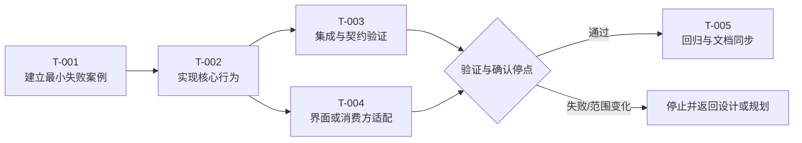

# 任务计划

## 先看结论

- 本批次要交付的用户可见结果：
- 任务数量和主要模块：
- 可连续执行范围：
- 必须停止确认的节点：
- 本次需要确认：

## 元信息

- work-item-id：
- 功能：
- 负责人：
- 状态：草稿 / 已确认 / 进行中 / 完成
- 最后更新：
- 对比基线：初版，无对比基线 / 上一确认文档路径 + Git commit
- 需求、设计与 API 契约：

## 本次变化

| 变更项 | 上一版 | 本版 | 变更原因 | 影响范围 |
| --- | --- | --- | --- | --- |
| 初版 | 无 | 建立任务基线 | 设计已确认 | 当前 work item |

## 建议阅读路径

- 业务/产品：先看交付结果、依赖图和确认停点。
- 开发：继续看任务表、资产路径、依赖和连续执行策略。
- 测试：重点看验证锚点、等级、回归和完成证据。

## 任务依赖与执行停点

这张图回答：哪些任务串行、哪些可以并行，何时必须验证或让用户确认？

关键结论：

- 核心行为先有失败案例或验证锚点，再进入实现。
- `T-003` 与 `T-004` 只有在文件和状态边界独立时才可并行。
- 验证失败、范围变化、V3 风险或用户确认点命中时必须停止。

## 前置条件

- 需求已确认：
- 设计已确认：
- API/数据模型已确认，如适用：
- 测试策略已确认：
- 资产边界配置 `.codex-workflow/asset-boundaries.json` 已确认：

## 数据源与真实 API 联调计划

- 开发数据源：Fixture / Mock / 真实 API / 混合
- 当前集成状态：未开始 / `FIXTURE_READY` / `API_PENDING` / `CONDITIONAL_MERGED` / `API_INTEGRATED` / `QUALITY_PASS`
- 真实 API 联调是否属于本次确认范围：否 / 是
- Fixture/Mock 退出条件与生产路径隔离检查：
- 真实 API 联调任务 ID、环境、数据范围和验证入口：
- API 不可用证据：不适用 / 依赖、环境、时间与影响

仅在用户明确批准有条件合入时填写：

- 批准人：
- 批准时间：
- 源候选与候选指纹：
- 目标业务分支：
- 批准范围与原因：
- 到期条件：
- 补偿任务：

`FIXTURE_READY` 不是 API 联调完成；`CONDITIONAL_MERGED` 不是验收或交付。真实 API 联调与验收任务在 `QUALITY_PASS` 前不得关闭。

## 目标使用终端与适配边界

| 使用终端 | 本批任务是否覆盖 | 允许的适配范围 | 明确禁止 | 验证视口/设备 |
| --- | --- | --- | --- | --- |
| PC Web |  |  |  |  |
| 移动 Web |  |  |  |  |
| iOS/Android App |  |  |  |  |
| 桌面客户端 |  |  |  |  |
| 大屏 |  |  |  |  |

- 任务只能拆分已确认终端的工作。未明确列为支持的终端不得自行适配。
- 响应式、触摸、移动端截图和移动 E2E 只有在需求与设计明确支持移动端时才进入任务与验证计划。

## 实现任务

| ID | 用户/系统结果 | 文件/模块 | 验证等级 | 连续执行 | Subagent | 最小失败案例/验证锚点 | 中文备注覆盖点 | 文档漂移 | 依赖 |
| --- | --- | --- | --- | --- | --- | --- | --- | --- | --- |
| `T-001` |  |  | V0/V1/V2/V3 | 可连续 / 谨慎 / 必须停 | 不需要 / 实现 / 排查 / 审查 |  |  |  |  |

## 资产落点计划

| 任务 ID | 资产类型 | 计划完整路径 | 允许根目录 | 禁止根目录 | 落点依据 | 门禁结果 |
| --- | --- | --- | --- | --- | --- | --- |
| `T-001` | 运行时 / 测试 / 构建 / 迁移 / 文档 |  |  | `specs/`、`docs/` 或项目声明目录 | manifest / 构建或测试配置 / 项目惯例 | 通过 / 阻断 |

## 验证计划

| 测试 ID | 任务/AC | 检查命令或步骤 | 预期结果 | 证据位置 |
| --- | --- | --- | --- | --- |
| `TC-001` | `<work-item-id>/T-001` |  |  |  |

验证等级：V0 文档或无行为变化；V1 低风险单点；V2 标准功能或普通 bugfix；V3 生产、权限、安全、数据、性能、金额、跨系统或 hotfix。

## 连续执行与停止条件

| 任务范围 | 是否允许连续 | 停止条件 | 用户授权记录 |
| --- | --- | --- | --- |
|  |  | 范围变化 / 验证失败 / V3 / 用户确认 / 本机资源异常 |  |

## Subagent 边界

| 任务范围 | 建议 | 角色 | 允许文件 | 禁止事项 | 主 agent 复核 |
| --- | --- | --- | --- | --- | --- |
|  | 不需要 / 建议 / 强烈建议 | 实现 / 排查 / 规格 / 质量 / 测试 |  | 公共状态、同一迁移、同一契约不可并行 | diff / 验证 / 漂移 / 风险 |

## 文档漂移与中文代码备注

| 检查 | 是否涉及 | 更新或备注位置 |
| --- | --- | --- |
| 需求、AC、规则或计算口径 |  |  |
| 设计、API、数据模型 |  |  |
| INDEX、入口或公共文档补丁 |  |  |
| 业务规则、公式、映射、异常、性能中文备注 |  |  |

## 对抗式审查计划

| 风险 | 场景 | 检查方式 | 对应测试 |
| --- | --- | --- | --- |
| 极端输入 / 权限 / 并发 / 性能 / UI 渲染 |  |  |  |

## 完成证据

- 已运行命令：
- 手工检查：
- 截图或日志：
- 已知剩余风险：

## 追溯

| 对象 | 完整引用 | 文档路径或章节 |
| --- | --- | --- |
| 任务 | `<work-item-id>/T-001` | 本文“实现任务” |
| AC | `<work-item-id>/AC-001` |  |
| 测试 | `<work-item-id>/TC-001` | 本文“验证计划” |

## 图表豁免

默认不豁免。用户明确要求时记录用户、任务依赖图和原因。

## 人类可读性检查

| 门禁 | 结果 | 证据或说明 |
| --- | --- | --- |
| `DOC-G01`、`DOC-G04` | 通过 / 豁免 / 阻断 |  |
| `DOC-G05` 至 `DOC-G12` | 通过 / 阻断 |  |

## 人工确认与下一步

- 任务、依赖、验证和停止条件是否确认：否 / 是
- 连续执行授权：未授权 / 已授权范围
- 推荐下一步：继续规划 / `company-implementation-runner`
- 阶段边界：计划确认不自动等于编码授权，必须记录用户明确授权。
