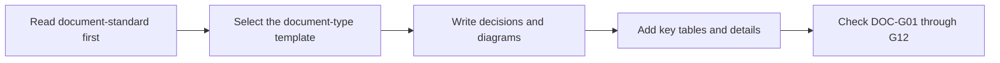

# Project Context Index

Use this file as the first stop for project context. Keep summaries short and link only documents that should guide future Codex work.

## Project Snapshot

- Product:
- Primary users:
- Core business constraints:
- Primary technical stack:
- Test commands:
- Build commands:
- Local run commands:

## Target Client Baseline

“Client” here means the user-facing product form, not TCP/HTTP network ports.

| Target client | Support status | Shared page/code/API | Viewport, browser, and input | Responsive/touch requirement |
| --- | --- | --- | --- | --- |
| PC Web | Needs confirmation |  |  |  |
| Mobile Web | Needs confirmation |  |  |  |
| iOS/Android App | Needs confirmation |  |  |  |
| Desktop client | Needs confirmation |  |  |  |
| Large display | Needs confirmation |  |  |  |

- Unconfirmed clients are unsupported by default; do not expand adaptation, interaction, or test scope from them.
- UI features inherit this baseline. A feature exception must be explicit in requirements and confirmed by the user.
- A PC-only product names its minimum viewport, browser, and input method. A non-UI feature may state “no direct client difference.”

## Asset Placement Gate

- Configuration: `.codex-workflow/asset-boundaries.json`
- Confirmation status: needs confirmation
- Engineering asset roots: needs confirmation
- Declare complete repository-relative paths in requirements, design, or planning before implementation; check changed files before closeout.
- Confirm automatic inferences after project bootstrap. Unconfirmed roots are not formal constraints.

## Global Documents

| Document | Purpose | Read When |
| --- | --- | --- |
| `specs/global/INDEX.md` | Context map and command index | Every task |
| `specs/global/assets/document-standard.md` | Formal-document reading structure and quality gates | Creating or substantially changing a formal document |
| `specs/global/assets/requirements-template.md` | Requirements template | Creating or refining feature requirements |
| `specs/global/assets/design-template.md` | Technical design template | Designing feature implementation |
| `specs/global/assets/data-model-template.md` | Data-model and table-design template | Designing relationships, tables, and fields |
| `specs/global/assets/business-rules-template.md` | Business-rule and calculation-semantics template | Complex rules, formulas, or state transitions |
| `specs/global/assets/api-contract-template.md` | API contract template | Frontend/backend or service boundary work |
| `specs/global/assets/tasks-template.md` | Task planning template | Breaking approved work into implementation steps |
| `specs/global/assets/spike-report-template.md` | Spike report template | `/spike` work |
| `specs/global/assets/hotfix-report-template.md` | Hotfix report template | `/hotfix` work |
| `specs/global/assets/requirements-prototype-record-template.md` | Requirements prototype approval record | Promoting an approved prototype into the requirements baseline |
| `specs/global/assets/quality-validation-report-template.md` | Independent quality validation report | Delivery acceptance triggered after implementation |
| `specs/global/assets/delivery-closeout-template.md` | Delivery closeout report | Closing a feature, milestone, or release |

## Feature Specs

| Feature | Status | Requirements | Design | Tasks | Notes |
| --- | --- | --- | --- | --- | --- |
| Example | Draft | `specs/features/example/requirements.md` | `specs/features/example/design.md` | `specs/features/example/tasks.md` | Replace with real features |

## Current Risks

- Asset placement configuration has not been confirmed.
