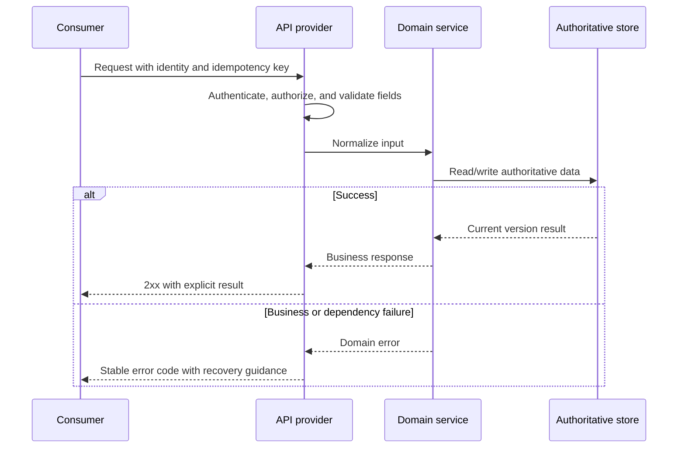

# API Contract

Authoring instruction (remove from finished document): identify reader and purpose; follow [communication standard](human-output-standard.md). Keep invocation/authority logs and detailed candidate identity in existing execution records; use [execution record template](execution-record-template.md) when needed. Retain technical specifications and evidence needed to decide or operate; remove unused template prompts.

## Decision Summary

- User/system capability supported:
- Consumer and provider:
- Successful result:
- Most important error and compatibility boundary:
- Confirmation needed now:

## Metadata

- work-item-id:
- Contract ID: `API-001`
- Endpoint:
- Owner:
- Status: draft / confirmed / changed
- Last updated:
- Comparison baseline: initial edition, no comparison baseline / previous approved path + Git commit
- Provider / consumer:
- Related requirements and design:

## What Changed

| Change | Previous | Current | Reason | Impact |
| --- | --- | --- | --- | --- |
| Initial edition | None | API contract | First approval | Current work item |

## Reading Guide

- Business/product: read the decision, sequence, and user behavior on errors.
- Development: continue with request, response, validation, compatibility, and security.
- QA: focus on the error matrix, examples, and contract verification.

## Call Sequence

This diagram answers: how does the consumer pass authentication, validation, business processing, and persistence to receive a result?



Key conclusions:

- Identity, permission, and input validation complete before business processing.
- Error codes remain stable; consumers do not branch on message text.
- Version, idempotency, and compatibility behavior are contractual rather than guessed by consumers.

## Request or Input

```json
{
  "requestId": "req-20260810-001",
  "projectId": 1001
}
```

| Field | Type | Required | Business meaning | Validation | Source |
| --- | --- | --- | --- | --- | --- |
| `requestId` | string | yes | Idempotency or trace identity | Length and uniqueness per contract | Consumer-generated |

## Response or Output

```json
{
  "code": "SUCCESS",
  "data": {
    "projectId": 1001,
    "status": "ACTIVE"
  }
}
```

| Field | Type | Nullable | Business meaning | Source/calculation owner |
| --- | --- | --- | --- | --- |
| `data.status` | string | no | Current authoritative state | Domain service |

## Error Semantics

| Condition | HTTP/error code | Response meaning | Consumer behavior | Retryable |
| --- | --- | --- | --- | --- |
| Forbidden | `403/FORBIDDEN` | Do not reveal object existence | Show no-permission state | no |
| Version conflict | `409/VERSION_CONFLICT` | Current state changed | Refresh then retry | conditional |

## Compatibility and Versioning

- Backward compatible:
- Added, deprecated, or renamed fields:
- Version policy and compatibility window:
- Consumer upgrade order:
- Idempotency, paging, sorting, and timezone:

## Security, Privacy, and Logging

- Authentication and authorization:
- Tenant or data isolation:
- Sensitive fields and redaction:
- Allowed and forbidden log content:
- Rate limiting, timeout, and replay protection:

## Contract Verification

| Test ID | Scenario | Provider check | Consumer check | Mock/fixture | Evidence |
| --- | --- | --- | --- | --- | --- |
| `TC-001` | Success |  |  |  |  |
| `TC-002` | Main error |  |  |  |  |
| `TC-003` | Backward compatibility |  |  |  |  |

## Traceability

| Object | Full reference | Document path or section |
| --- | --- | --- |
| API | `<work-item-id>/API-001` | This document |
| AC | `<work-item-id>/AC-001` |  |
| Test | `<work-item-id>/TC-001` | Contract Verification |

## Diagram Waiver

No waiver by default. After an explicit user request, record the user, waived call-sequence diagram, and reason.

## Human Readability Check

| Gate | Result | Evidence or explanation |
| --- | --- | --- |
| `DOC-G01`, `DOC-G04` | pass / waived / blocked |  |
| `DOC-G05` through `DOC-G12` | pass / blocked |  |

## Human Confirmation and Next Step

- Provider and consumer confirmed input, output, errors, and compatibility: no / yes
- Remaining contract blockers:
- Recommended next step: continue contract design / `company-feature-planning`
