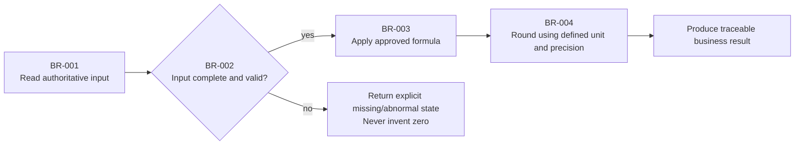

# Business Rules and Calculation Semantics

## Decision Summary

- Rules governed here:
- Applicable users and scenarios:
- Key state or calculated result:
- Most easily misunderstood semantic:
- Confirmation needed now:

## Metadata

- work-item-id:
- Feature:
- Owner:
- Status: draft / confirmed / changed
- Last updated:
- Comparison baseline: initial edition, no comparison baseline / previous approved path + Git commit
- Related requirements and design:

## What Changed

| Change | Previous | Current | Reason | Impact |
| --- | --- | --- | --- | --- |
| Initial edition | None | Rule baseline | First approval | Current work item |

## Reading Guide

- Business/product: decision, rule flow, formula explanation, and worked example.
- Development: field sources, state changes, precision, exception handling, and authority boundaries.
- QA: rule IDs, counterexamples, boundary values, and acceptance mapping.

## Scope and Terms

| Term/field | Meaning | Source | Unit | Precision/format | Notes |
| --- | --- | --- | --- | --- | --- |
|  |  |  |  |  |  |

## Rule and Calculation Flow

This diagram answers: how do inputs pass through rule decisions, exceptions, and calculation to form a business result?

Key conclusions:

- Validate source, time range, unit, and completeness before calculation.
- Missing or abnormal data uses explicit status instead of defaulting to zero or success.
- Rounding occurs only at the defined step; the frontend cannot redefine authoritative semantics.

## Operational Rules

| Rule ID | Scenario | Preconditions | Action/event | System response | State change | Exception handling |
| --- | --- | --- | --- | --- | --- | --- |
| `BR-001` |  |  |  |  |  |  |

## State Transitions

- Initial state:
- Allowed states and entry conditions:
- Terminal state:
- Forbidden transitions:
- Conflict, duplicate, and concurrency handling:

## Calculation Logic

### Formula `BR-003`

- Natural-language explanation:
- Mathematical expression: `result = input_a + input_b`
- Input sources:
- Unit and currency:
- Precision and rounding:
- Missing, abnormal, and boundary values:
- Calculation owner: backend / data-processing layer / other authoritative component

## Complete Worked Example

| Input | Calculation | Expected output | Acceptance/test |
| --- | --- | --- | --- |
| `input_a=10`, `input_b=5` | `10 + 5` | `15` | `<work-item-id>/TC-001` |

## Adversarial Scenarios

| Scenario | Risk | Expected behavior | Test |
| --- | --- | --- | --- |
| Missing input | Fabricated result | Return missing status; do not fill zero |  |
| Duplicate submission | Duplicate calculation or write | Idempotent result or explicit conflict |  |

## Unconfirmed Semantics and Decisions

| Object | Current treatment | Owner | Blocking | Decision |
| --- | --- | --- | --- | --- |
|  |  |  |  |  |

## Traceability

| Object | Full reference | Document path or section |
| --- | --- | --- |
| Rule | `<work-item-id>/BR-001` | Operational Rules |
| Acceptance | `<work-item-id>/AC-001` |  |
| Test | `<work-item-id>/TC-001` |  |

## Diagram Waiver

No waiver by default. After an explicit user request, record the user, waived rule/calculation diagram, and reason.

## Human Readability Check

| Gate | Result | Evidence or explanation |
| --- | --- | --- |
| `DOC-G01`, `DOC-G04` | pass / waived / blocked |  |
| `DOC-G05` through `DOC-G12` | pass / blocked |  |

## Human Confirmation and Next Step

- Operations, state, formulas, field semantics, exceptions, and examples confirmed: no / yes
- Remaining blocking semantics:
- Recommended next step: continue rule clarification / `company-feature-design`
