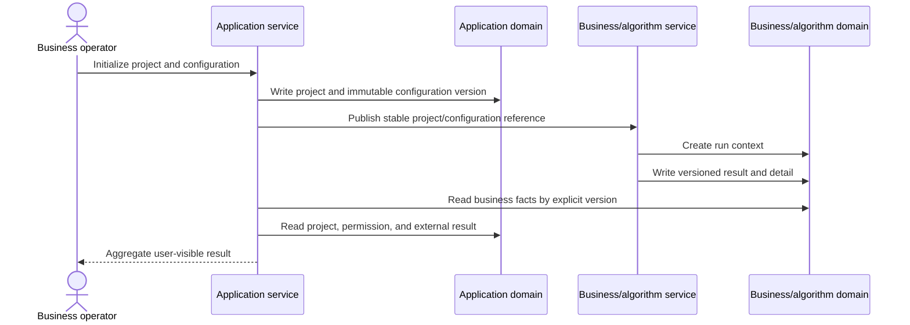

# Data Model Design

## Metadata

- work-item-id:
- Feature/milestone:
- Owner:
- Status: draft / confirmed / changed
- Complexity: L1 / L2 / L3
- Last updated:
- Comparison baseline: initial edition, no comparison baseline / previous approved path + Git commit
- Related requirements and technical design:

## Decision Summary

- Why these tables are needed:
- Table count: create / extend / reuse unchanged / retire gradually
- Authoritative data locations:
- Most important data chain:
- Invariants:
- Confirmation needed now:

## What Changed

| Change | Previous | Current | Reason | Impact |
| --- | --- | --- | --- | --- |
| Initial edition | None | Data-model baseline | First approval | Current work item |

## Reading Guide and Legend

- Business/product: read the decision, object inventory, relationship view, formation sequence, and page mapping.
- Development: continue with read/write steps, keys, table specifications, migration, and compatibility.
- QA: focus on invariants, missing-data semantics, concurrency constraints, and structural acceptance.
- Actions: create / extend / reuse unchanged / retire gradually.
- Lines: solid means same-domain physical or strongly consistent relationships; dashed means cross-database, asynchronous, or logical mapping.

## Data Object Inventory

| Domain | Table | Action | Authoritative responsibility | Writer | Reader | Page/flow |
| --- | --- | --- | --- | --- | --- | --- |
|  |  |  |  |  |  |  |

## Table Relationship Overview

This diagram answers: how are authoritative objects related, where do cross-domain chains meet, and which data must not overwrite other authority?

```mermaid
flowchart TB
    subgraph APP["Application domain"]
        PROJECT["Project master<br/>project"]
        CONFIG["Configuration version<br/>project_config_version"]
        RESULT["User-visible result<br/>business_result"]
        PROJECT -->|project_id| CONFIG
        PROJECT -->|project_id| RESULT
    end
    subgraph DOMAIN["Business/algorithm domain"]
        SESSION["Run context<br/>session"]
        BATCH["Result version<br/>result_batch"]
        DETAIL["Result detail<br/>result_detail"]
        SESSION -->|session_id| BATCH
        BATCH -->|result_batch_id| DETAIL
    end
    CONFIG -.->|stable business code, logical mapping| SESSION
    DETAIL -.->|aggregate by project, date, and version| RESULT
```



Key conclusions:

- Project and configuration are application-domain authority; run context and detail are business-domain authority.
- Cross-domain relationships use stable business codes or explicit mappings, not unmaintainable cross-database foreign keys.
- The chains meet only in service aggregation and cannot copy data while pretending to be the other authority.

## Data Formation Sequence

This diagram answers: from initialization to user query, who reads, validates, and writes each fact?



Key conclusions:

- Initialization fixes project and configuration before creating a run context.
- Corrections create a new result version instead of overwriting published facts.
- Page queries use one project, date, context, and result version consistently.

## Step-by-Step Reads and Writes

| Step | Trigger | Read/validate | Write/update | State change | Invariant |
| --- | --- | --- | --- | --- | --- |
| 1 |  |  |  |  |  |

## Key Relationship Fields

| Upstream | Downstream | Join field | Relationship type | Cardinality | Integrity guarantee | Explanation |
| --- | --- | --- | --- | --- | --- | --- |
|  |  |  | physical FK / logical mapping / version link | 1:1 / 1:N / N:M | unique key / FK / transaction / contract test |  |

## Complete Per-Table Design

### Table A: `table_name` (create / extend / reuse / retire)

**One-sentence purpose:**

**Authority boundary:** State what this table authoritatively owns and what it never stores or infers.

**Read/write responsibility:** Who creates, changes, and reads it.

#### Field Definitions

| Field | Type | Required | Status | Business meaning | Source/generation rule |
| --- | --- | --- | --- | --- | --- |
| `id` | BIGINT | yes | existing / new / normalized / conditional data | Primary key | Database-generated |

#### Constraints and Indexes

| Type | Field/expression | Purpose | Concurrency or exception guarantee |
| --- | --- | --- | --- |
| Primary key | `id` | Stable identity |  |

#### Lifecycle and Exception Semantics

- Creation condition:
- Allowed changes:
- Expiry, archive, or correction:
- Null and missing value:
- Delay and failure:
- Historical version:

#### Redacted Example Record (keep for complex tables)

```json
{
  "id": 1001,
  "status": "ACTIVE",
  "version": 1
}
```

## Page and API Read Mapping

| Page/API content | Direct source | Aggregation/calculation | Missing behavior | Permission boundary |
| --- | --- | --- | --- | --- |
|  |  |  | hide / empty state / explicit error; never fabricate zero |  |

## Migration, Compatibility, and Scripts

- Create/alter/backfill order:
- Dual-write and stop condition:
- Historical data treatment:
- Versioned state-change script directory:
- Precheck and read-only postcheck:
- Rollback, recovery, and irreversible changes:
- Full SQL script path and checksum:

## First Principles and Adversarial Review

- Ground truths:
- Invariants:
- Minimum viable conditions:
- Duplicate submission, concurrency, version conflicts, missing, delayed, and abnormal values:
- Evidence that would overturn this model:

## Structural Acceptance

| Acceptance ID | Structural decision | Verification | Evidence |
| --- | --- | --- | --- |
| `TC-001` | Every user-visible field traces to an authoritative source | Query-chain review / contract test |  |
| `TC-002` | One current version exists while history remains available | Unique constraint / concurrency test |  |
| `TC-003` | Missing data is not fabricated as zero or success | Integration test |  |

## L1/L2/L3 Depth

- L1 may combine sections but keeps the decision, relationship diagram, fields, constraints, read/write logic, and acceptance.
- L2 uses every section.
- L3 adds detail for cross-domain links, migration, concurrency, recovery, versioning, and consistency.

## Traceability

| Object | Full reference | Document path or section |
| --- | --- | --- |
| Requirement | `<work-item-id>/AC-001` |  |
| Design decision | `<work-item-id>/D-001` |  |
| Data verification | `<work-item-id>/TC-001` | Structural Acceptance |

## Diagram Waiver

No waiver by default. Record relationship and formation-sequence waivers separately after an explicit user request:

| User | Waived diagram | Reason |
| --- | --- | --- |
|  |  |  |

## Human Readability Check

| Gate | Result | Evidence or explanation |
| --- | --- | --- |
| `DOC-G01` | pass / blocked |  |
| `DOC-G04` | pass / waived / blocked |  |
| `DOC-G05` through `DOC-G12` | pass / blocked |  |

## Human Confirmation and Next Step

- Table responsibilities, relationships, versions, and migration confirmed: no / yes
- Remaining blockers:
- User confirmation:
- Recommended next step: continue data design / return to technical design / `company-feature-planning`
