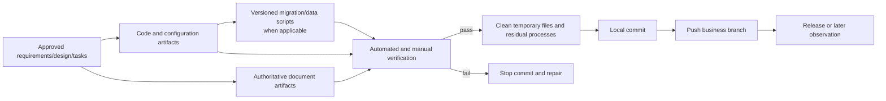

# Delivery Closeout Report

Authoring instruction (remove from finished document): identify reader and purpose; follow [communication standard](human-output-standard.md). Keep invocation/authority logs and detailed candidate identity in existing execution records; use [execution record template](execution-record-template.md) when needed. Retain technical specifications and evidence needed to decide or operate; remove unused template prompts. Headings and section order may change. First drafts need no change table; version-change reviews still explain baseline, changes, and impact. Select diagrams by purpose and content under the [document standard](document-standard.md), preserving existing acceptance and evidence conditions.

## Decision Summary

- User-visible result actually delivered:
- Code, document, script, and configuration artifacts:
- Verification level and result:
- Known remaining risk:
- Confirmation needed now: commit / push / do not release
- Integration disposition: formal delivery / conditional merge and not delivered

When the API is unavailable and only a conditional merge is approved, state this fact exactly: **This merge does not mean formal delivery**. Only the business branch was merged; real API integration and real-page acceptance remain incomplete.

## Metadata

- work-item-id:
- Feature/task batch/milestone:
- Owner:
- Status: awaiting closeout / verified / committed / pushed
- Last updated:
- Comparison baseline: initial edition, no comparison baseline / previous closeout report + Git commit
- Business branch:

## API-Unavailable Conditional-Merge Record

- Current state: not applicable / `FIXTURE_READY` / `API_PENDING` / `CONDITIONAL_MERGED`
- API unavailable evidence, time, and impact:
- Approved by:
- Approved at:
- Source candidate and fingerprint:
- Target business branch:
- Approved scope and reason:
- Expiry condition:
- Compensating task:
- Confirm no release, no deployment, and API-integration task remains open: no / yes
- Evidence that the production path has no silent Fixture/Mock fallback:

Customer notice: Only the Fixture-based frontend candidate is complete and approved for merge into the business branch above. Because the API is unavailable, real API integration and real-page acceptance remain incomplete. The status is "conditional merge / not delivered" and must not prove real data, charts, or business calculations correct.

## What Changed

| Change | Before delivery | After delivery | Reason | Impact |
| --- | --- | --- | --- | --- |
|  |  |  |  |  |

## Reading Guide

- Business/product: decision, delivered artifacts, remaining risk, and release state.
- Development: artifact relationship, cleanup, verification, commit, and push.
- QA/operations: evidence, migration, release, rollback, and observation.

## Artifact Relationship and Release Flow

This diagram answers: how do requirements, code, documents, scripts, and verification form a committable, releasable, and recoverable delivery?

Key conclusions:

- Documents, code, and versioned scripts form the delivery together; runtime success alone is insufficient.
- A failed verification cannot produce a completion claim.
- Temporary files, browser processes, and local services are cleaned within scope before commit.

## Delivered Artifact Inventory

| Artifact | Type | Path | Task/AC | Status | Explanation |
| --- | --- | --- | --- | --- | --- |
|  | code / document / config / script / data migration |  |  | complete / incomplete / not applicable |  |

## Cleanup and Repository Check

- Temporary files, generated output, and debug code:
- Local services, Playwright/browser, and residual processes:
- Pre-existing user changes in `git status`:
- Current change scope and unexpectedly large files:
- Versioned database scripts, checksums, and execution boundaries:

## Verification Evidence

| Test ID | Command/step | Expected | Actual | Evidence |
| --- | --- | --- | --- | --- |
| `TC-001` |  |  |  |  |

## Release, Commit, and Recovery

- Commit:
- Push branch and remote:
- Database/config/infrastructure state: generated in repository / executed in environment / not executed
- Release or deployment state:
- Rollback and recovery:
- Observation window and metrics:

## Remaining and Adjacent Work

| Item | Current scope | Risk | Owner | Follow-up entry |
| --- | --- | --- | --- | --- |
|  | no / yes |  |  |  |

## Traceability

| Object | Full reference | Document path or section |
| --- | --- | --- |
| Task | `<work-item-id>/T-001` |  |
| Verification | `<work-item-id>/TC-001` | Verification Evidence |

## Diagram Waiver

No waiver by default. After an explicit user request, record the user, waived artifact/release diagram, and reason.

## Human Readability Check

| Gate | Result | Evidence or explanation |
| --- | --- | --- |
| `DOC-G01`, `DOC-G04` | pass / waived / blocked |  |
| `DOC-G05` through `DOC-G12` | pass / blocked |  |

## Human Confirmation and Next Step

- Allow local commit: no / yes
- Allow push of the current business branch: no / yes
- Closeout state: incomplete / complete
- Recommended next step: repair blocker / commit / push / release observation
