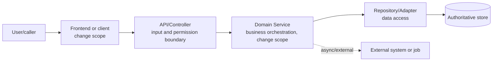
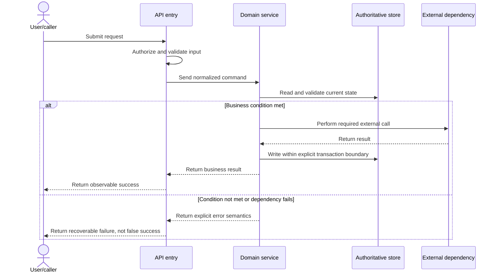

# Technical Design

## Metadata

- work-item-id:
- Feature:
- Owner:
- Status: draft / confirmed / changed
- Complexity: L1 / L2 / L3
- Last updated:
- Comparison baseline: initial edition, no comparison baseline / previous approved path + Git commit
- Requirements and business rules:

## Decision Summary

- Recommended design:
- Requirements/ACs addressed:
- Affected systems, modules, and data:
- Most important design decision:
- Main cost and risk:
- User confirmation needed now:

## What Changed

| Change | Previous | Current | Reason | Impact |
| --- | --- | --- | --- | --- |
| Initial edition | None | Technical-design baseline | First approval | Current work item |

## Reading Guide

- Business/product: read the decision, architecture, core sequence, and confirmation points first.
- Development: continue with module boundaries, data/API, asset placement, release, and recovery.
- QA: focus on traceability, exception sequence, test strategy, and verification stops.
- Legend: solid lines are synchronous calls; dashed lines are asynchronous, event, or logical relationships; nodes labeled `change` are in scope.

## Requirements, Rules, and AC Traceability

| Full reference | Requirement/rule decision | Technical carrier | Verification |
| --- | --- | --- | --- |
| `<work-item-id>/AC-001` |  |  | `<work-item-id>/TC-001` |

## Overall Technical Architecture

This diagram answers: how do callers, application modules, data, and external dependencies work together, and where is this change located?

Key conclusions:

- The entry handles input, permission, and error protocol without redefining business rules.
- The Domain Service owns orchestration; authoritative data is reached through the Repository/Adapter.
- External calls and local transaction boundaries are explicit so failures cannot produce false success.

## Module Responsibilities and Boundaries

| Module | Responsibility | Explicit non-responsibility | Input | Output | Dependency | Change |
| --- | --- | --- | --- | --- | --- | --- |
|  |  |  |  |  |  | create / modify / reuse |

## Core Call Sequence

This diagram answers: how does one core request complete validation, processing, persistence, and response?

Key conclusions:

- Authorization and input validation happen at the entry; business conditions are decided by the service.
- Write and external-call ordering must match idempotency, compensation, and consistency design.
- Failure paths return identifiable errors and preserve retry or human-recovery evidence when needed.

## Key Exception Sequence and Failure Semantics

| Failure point | Trigger | External behavior | Data state | Retry/compensation | Observability evidence |
| --- | --- | --- | --- | --- | --- |
|  |  |  |  |  |  |

## Data Model and State Design

- Table-structure impact: no / yes; when yes, link the `data-model.md` artifact created from `data-model-template.md`.
- Authoritative data source:
- State machine and forbidden transitions:
- Version, cache, and consistency:
- Missing, delayed, and historical data semantics:

## Option Comparison and Decision

| Decision ID | Option | Core approach | Benefit | Cost/risk | Suitable when | Decision |
| --- | --- | --- | --- | --- | --- | --- |
| `D-001` | Recommended |  |  |  |  | recommend |
|  | Alternative A |  |  |  |  | reject |

- Why alternatives were rejected:
- New evidence that would overturn this choice:
- User confirmation:

## API and Module Contracts

| Contract ID | Provider | Consumer | Input | Output | Error semantics | Compatibility | Authoritative document |
| --- | --- | --- | --- | --- | --- | --- | --- |
| `API-001` |  |  |  |  |  |  |  |

Use `api-contract-template.md` for frontend/backend, service, or external-system boundaries.

## Permission, Performance, and Runtime Quality

- Authentication, roles, and data isolation:
- Performance budget, capacity, and timeout:
- Cache, concurrency, and idempotency:
- Logs, metrics, traces, and alerts:
- Privacy and sensitive data:
- Degradation, retry, compensation, and circuit breaking:

## Asset Ownership and Implementation Mapping

| Artifact | Asset type | Owning project/module | Full repository-relative path | Create/modify | Placement evidence | Verifier |
| --- | --- | --- | --- | --- | --- | --- |
|  |  |  |  |  | manifest / build or test config / project convention |  |

- Boundary config: `.codex-workflow/asset-boundaries.json`
- Explicit exceptions with owner and validation:

## Test Strategy

| Test ID | Requirement/sequence node | Level | Verification | Failure condition | Evidence |
| --- | --- | --- | --- | --- | --- |
| `TC-001` | `<work-item-id>/AC-001` | unit / integration / contract / E2E |  |  |  |

## Release, Migration, and Recovery

- Deployment order:
- Data or configuration migration:
- Compatibility window:
- Feature flag:
- Rollback condition and action:
- Irreversible change:
- Post-release observation:

## First Principles and Adversarial Review

- Ground truths:
- Invariants:
- Minimum viable conditions:
- Counterexamples, extreme inputs, concurrency, and failure scenarios:
- Evidence that would overturn the design:

## Traceability

| Object | Full reference | Document path or section |
| --- | --- | --- |
| Design decision | `<work-item-id>/D-001` | Option Comparison and Decision |
| API | `<work-item-id>/API-001` |  |
| Test | `<work-item-id>/TC-001` | Test Strategy |
| Downstream task |  |  |

## Diagram Waiver

No waiver by default. Record architecture and sequence waivers separately after an explicit user request:

| User | Waived diagram | Reason |
| --- | --- | --- |
|  |  |  |

## Human Readability Check

| Gate | Result | Evidence or explanation |
| --- | --- | --- |
| `DOC-G01` | pass / blocked |  |
| `DOC-G03` | pass / waived / blocked |  |
| `DOC-G04` | not triggered / pass / waived / blocked |  |
| `DOC-G05` through `DOC-G12` | pass / blocked |  |

## Human Confirmation and Next Step

- Ready for task planning: no / yes
- Implementation authorization: not granted / invalidated / awaiting user confirmation
- Remaining interface, data, or risk decisions:
- User confirmation of the recommended design:
- Recommended next step: continue design / `company-feature-planning`
- Phase boundary: do not enter task planning or implementation without explicit user authorization.
