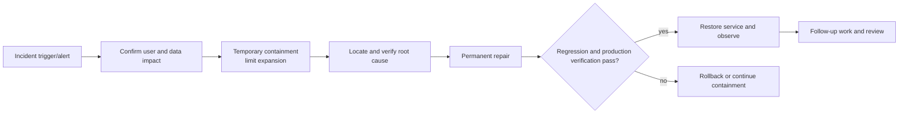

# Hotfix Report

## Metadata

- work-item-id:
- Incident/hotfix:
- Owner:
- Severity:
- Status: active / contained / recovered / closed
- Timeline:
- Comparison baseline: initial edition, no comparison baseline / previous approved path + Git commit

## Decision Summary

- Fault and user impact:
- Current status:
- Temporary containment:
- Root cause and permanent repair:
- Confirmation needed now:

## What Changed

| Change | Previous | Current | Reason | Impact |
| --- | --- | --- | --- | --- |
| Initial edition | None | Incident record | Hotfix started | Current incident |

## Reading Guide

- Business/management: impact, current status, recovery, and remaining risk.
- Development: fault chain, root cause, containment, and permanent-repair boundary.
- QA/operations: verification, monitoring, rollback, and follow-up work.

## Fault and Recovery Path

This diagram answers: how was the incident detected, contained, repaired, verified, and recovered?

Key conclusions:

- Containment limits impact and is not described as permanent repair.
- Root cause requires a reproduction or evidence chain rather than guessing from the last error.
- Recovery includes verification and observation, with explicit rollback on failure.

## Impact and Timeline

| Time | Event | User/data impact | Evidence |
| --- | --- | --- | --- |
|  |  |  |  |

## Root Cause and Repair Boundary

- Immediate cause:
- Root cause:
- Why prior verification missed it:
- Containment and expiry condition:
- Permanent repair:
- Explicitly unchanged scope:

## Changes and Verification

| Test ID | Check | Command/step | Expected result | Evidence |
| --- | --- | --- | --- | --- |
| `TC-001` | Minimum reproduction |  | fails before, passes after |  |
| `TC-002` | Regression |  | affected main path works |  |
| `TC-003` | Recovery observation |  | metrics and error rate recover |  |

## Release, Rollback, and Follow-up

- Release method and authorization:
- Rollback condition and steps:
- Data recovery or compensation:
- Observation window and metrics:
- Follow-up requirements, design, test, or monitoring work:

## Traceability

| Object | Full reference | Document path or section |
| --- | --- | --- |
| Repair task | `<work-item-id>/T-001` |  |
| Verification | `<work-item-id>/TC-001` | Changes and Verification |

## Diagram Waiver

No waiver by default. After an explicit user request, record the user, waived fault-and-recovery diagram, and reason.

## Human Readability Check

| Gate | Result | Evidence or explanation |
| --- | --- | --- |
| `DOC-G01`, `DOC-G04` | pass / waived / blocked |  |
| `DOC-G05` through `DOC-G12` | pass / blocked |  |

## Human Confirmation and Next Step

- Recovered and observation completed: no / yes
- Remaining risk and follow-up work:
- Incident can close: no / yes
