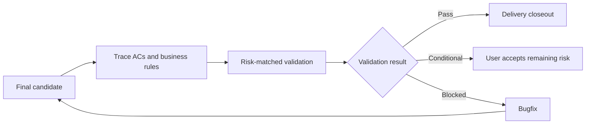

# Quality Validation Report

## Decision Summary

- Validation result: pass / conditional-pass / blocked
- User-visible outcome:
- Primary evidence:
- Unverified items and impact:
- Next step: delivery closeout / user risk acceptance / bugfix / requirements or design

## Metadata

- work-item-id:
- Scope: task batch / feature / milestone / release / post-hotfix compensation
- Formal report path: `quality-validation-report.md` in the authoritative task document directory, optionally with the project numbering prefix
- Independent quality validation: not-required / required / mandatory
- Owner:
- Validation time:
- Comparison baseline: first version, no baseline / previous approved document path + Git commit

## Capability and Execution Transparency

- Workflow layer: `company-quality-validation`
- Trace mode: `full-audit`
- Superpowers layer:
- Actual calls:
- Expert/plugin capabilities:
- Not called, lens only:

## Final Candidate Identity

- Current branch:
- HEAD commit:
- Diff SHA-256: computed from `git diff --binary HEAD -- <validated paths>`
- Untracked file paths and SHA-256:

| Validated paths | Type | Includes untracked files | Note |
| --- | --- | --- | --- |
|  | code / test / configuration / migration / asset | no / yes |  |

## What Changed

| Change | Previous | Current | Reason | Impact |
| --- | --- | --- | --- | --- |
| First version | None | Independent quality-validation baseline | Implementation complete | Current work item |

## Validation Route

Key decision: failures return to repair or document workflows and rerun the same acceptance scope; this stage never edits production code.

## Scope and Sources

- Authoritative requirements and ACs:
- Business rules and calculation semantics:
- Technical design, API, and data contracts:
- Completed tasks:
- Explicit exclusions:

## AC Trace Matrix

| AC/rule ID | User scenario | Validation type | Command or steps | Evidence | Result |
| --- | --- | --- | --- | --- | --- |
| `<work-item-id>/AC-001` |  | unit / integration / API / E2E / browser / manual |  |  | pass / fail / unverified |

## Environment and Data

| Item | Value | Difference from target | Risk |
| --- | --- | --- | --- |
| App version, dependencies, browser, database, test data |  |  |  |

## Verification Evidence

| Category | Command or steps | Result | Evidence location | Freshness |
| --- | --- | --- | --- | --- |
| Test / type / build / API / browser / performance / recovery |  |  |  | current final candidate / reusable |

## Adversarial Review

| Risk | Abnormal or boundary scenario | Expected | Actual | Decision |
| --- | --- | --- | --- | --- |
| Permission / concurrency / data / performance / compatibility / rendering |  |  |  |  |

## Defects and Loop

| Defect ID | Severity | Evidence | Route | Revalidation scope | Status |
| --- | --- | --- | --- | --- | --- |
|  |  |  | `company-bugfix-runner` / `company-feature-requirements` / `company-feature-design` / `company-feature-planning` |  |  |

## Unverified Items and Remaining Risk

| Item | Reason | Impact | Conditional acceptance allowed | User acceptance or expiry condition |
| --- | --- | --- | --- | --- |
|  |  |  | yes / no |  |

Conditional-pass hard guard: Security, permission, data-integrity, money or metric-formula, migration, rollback, or recovery risks cannot receive conditional pass.

Complete only for eligible remaining risk:

- Accepted by:
- Accepted at:
- Accepted scope:
- Expiry condition:
- Compensating task:

## Diagram Waiver

No waiver by default. Only an explicit user request records the user, scope, and reason.

## Human-Readability Check

| Gate | Result | Evidence or note |
| --- | --- | --- |
| `DOC-G01`, `DOC-G04` | pass / waived / blocked |  |
| `DOC-G05` through `DOC-G12` | pass / blocked |  |

## Human Confirmation and Next Step

- Validation result confirmed: no / yes
- Conditional risk explicitly accepted: not applicable / no / yes
- Delivery closeout readiness: not-ready / ready
- Recommended next workflow: `company-bugfix-runner` / `company-feature-requirements` / `company-feature-design` / `company-feature-planning` / `company-delivery-closeout`
