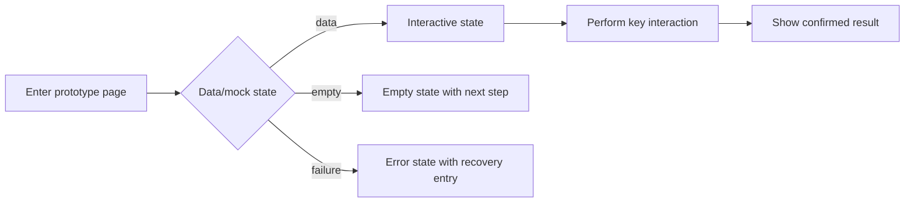

# Requirements Prototype Validation Record

## Decision Summary

- Requirements question validated:
- Confirmed page, interaction, or state:
- Content not promised by the prototype:
- Ready to become a requirements baseline:
- Confirmation needed now:

## Metadata

- work-item-id:
- Prototype feature:
- Owner:
- Status: draft iteration / awaiting confirmation / confirmed / withdrawn
- Last updated:
- Comparison baseline: initial edition, no comparison baseline / previous approved prototype record + Git commit
- Authoritative requirements document:

## What Changed

| Change | Previous | Current | User feedback/reason | Affected requirement or AC |
| --- | --- | --- | --- | --- |
| Initial edition | None | Prototype validation record | Iteration started | Current work item |

## Reading Guide

- Business/product: decision, page-state graph, validation list, and non-promised content.
- Design/development: write confirmed content back to requirements; do not treat prototype implementation as production design.
- QA: focus on states, interactions, and AC evidence.

## Page State and Interaction Flow

This diagram answers: how does a user enter the prototype, perform the key interaction, and see success, empty, or failure states?

Key conclusions:

- The prototype covers normal, empty, and failure states rather than only an ideal screenshot.
- Every interaction decision writes back to a requirements flow, rule, or AC.
- The prototype does not validate real APIs, databases, authentication, production data, or performance.

## Validation List and Evidence

| Validation ID | Page/interaction/state | User feedback | Requirements change | Evidence path |
| --- | --- | --- | --- | --- |
| `TC-001` |  |  |  |  |

## Prototype Scope and Boundary

- Draft path: `.codex-workflow/prototypes/<feature>/draft/`
- Confirmed baseline path:
- Mock data and assumptions:
- Real systems not connected:
- Prototype-code retention and cleanup:

## Convert to Requirements Baseline

- Requirements flows, rules, ACs, and copy updated:
- Rejected feedback and reason:
- Confirmation date, approver, and SHA-256:
- Explicit authorization for technical design: no / yes (prototype confirmation alone is not authorization)

## Traceability

| Object | Full reference | Document path or section |
| --- | --- | --- |
| Requirements flow | `<work-item-id>/F-001` |  |
| Acceptance | `<work-item-id>/AC-001` |  |
| Prototype validation | `<work-item-id>/TC-001` | Validation List and Evidence |

## Diagram Waiver

No waiver by default. After an explicit user request, record the user, waived page-state/interaction diagram, and reason.

## Human Readability Check

| Gate | Result | Evidence or explanation |
| --- | --- | --- |
| `DOC-G01`, `DOC-G04` | pass / waived / blocked |  |
| `DOC-G05` through `DOC-G12` | pass / blocked |  |

## Human Confirmation and Next Step

- Prototype decision: continue iteration / convert to requirements baseline / withdraw
- Recommended next step: `company-feature-requirements` / wait for explicit design authorization
