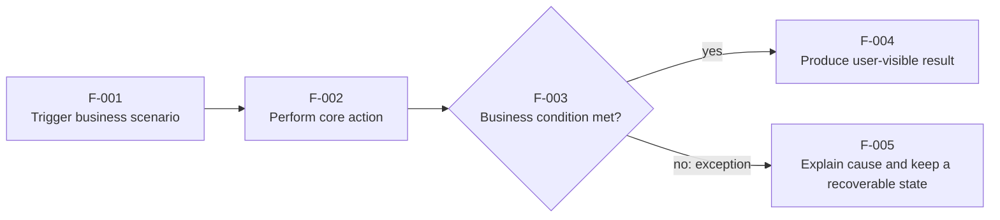

# Feature Requirements

## Decision Summary

- User problem:
- Requirements decision:
- User-visible result:
- Affected roles, pages, or flows:
- Confirmation needed now:

## Metadata

- work-item-id:
- Feature:
- Owner:
- Status: draft / confirmed / changed
- Complexity: L1 / L2 / L3
- Last updated:
- Comparison baseline: initial edition, no comparison baseline / previous approved path + Git commit
- Related discussion or ticket:

## What Changed

| Change | Previous | Current | Reason | Impact |
| --- | --- | --- | --- | --- |
| Initial edition | None | Requirements baseline | First approval | Current work item |

## Reading Guide

- Business/product: read the decision, user scenarios, business flow, scope, and open decisions first.
- Development: continue with operational steps, rules, ACs, and trace links.
- QA: focus on the main flow, exception paths, ACs, and boundary conditions.
- Legend: solid lines show the normal path; lines labeled `exception` show failure, exit, or human-handled paths.

## Users, Scenarios, and Value

| User/role | Current problem | Scenario | Target result | Success measure |
| --- | --- | --- | --- | --- |
|  |  |  |  |  |

## Target Clients and Adaptation Boundary

“Client” means PC Web, Mobile Web, an app, desktop client, or large display, not a network port. Inherit the project baseline from `specs/global/INDEX.md`; state any feature exception explicitly.

| Target client | Status: supported/inherited/deferred/unsupported | Shared page/code/API | Viewport, browser, and input | responsive/touch requirement | Related AC |
| --- | --- | --- | --- | --- | --- |
| PC Web |  |  |  |  |  |
| Mobile Web |  |  |  |  |  |
| iOS/Android App |  |  |  |  |  |
| Desktop client |  |  |  |  |  |
| Large display |  |  |  |  |  |

- Do not adapt clients that are not explicitly supported, and do not add their interactions, screenshots, browser matrix, or E2E scope.
- A PC-only feature names its minimum viewport, supported browsers, and mouse/keyboard needs. Requirements for responsive behavior, touch, and mobile-viewport verification apply only when mobile is explicitly supported.
- A backend-only or client-neutral feature states “no direct client difference” instead of manufacturing multi-client requirements.

## Target Business Flow

This diagram answers: how does the user move from the trigger to the result, including the important exception path?

Key conclusions:

- The main path starts at `F-001` and produces an observable result at `F-004`.
- `F-003` is a business decision point; frontend or implementation code cannot redefine it.
- The exception path reaches `F-005`; it must not masquerade as success or fail silently.

## Operational Steps and System Feedback

| Flow node | Preconditions | User action/business event | System response | Data/state change | Exception handling |
| --- | --- | --- | --- | --- | --- |
| `F-001` |  |  |  |  |  |
| `F-002` |  |  |  |  |  |
| `F-003` |  |  |  |  |  |

## Page and Interaction States

| Page/area | Entry condition | Visible content | Available action | Loading/empty/failure/unauthorized state |
| --- | --- | --- | --- | --- |
|  |  |  |  |  |

When there is no direct UI, state `This feature has no direct page` and explain which API, job, or business result exposes the change.

## Scope and Boundaries

### In Scope

- State the capability committed in this scope.

### Out of Scope

- State what does not belong to this requirement.

### Explicitly Deferred

- State discussed work that is deliberately deferred.

### External Dependencies and Existing-Feature Relationship

- State dependent systems, teams, data, or existing capabilities.

## Business Rules and Calculation Semantics

| Rule ID | Rule decision | Flow node | Exception behavior | Authoritative document/section |
| --- | --- | --- | --- | --- |
| `BR-001` |  | `F-003` |  |  |

Business-rules document decision: required / not required. Use `business-rules-template.md` for formulas, money, metrics, state machines, role differences, field semantics, abnormal values, or complex operations.

## Acceptance Criteria

| AC | Flow node | Given | When | Then | Counterexample/exception |
| --- | --- | --- | --- | --- | --- |
| `AC-001` | `F-001` through `F-004` |  |  |  |  |

## Assumptions, Open Questions, and Approved Decisions

### Assumptions

| Assumption | Why temporarily acceptable | Verification |
| --- | --- | --- |
|  |  |  |

### Open Questions

| Question | Owner | Blocking | Decision point |
| --- | --- | --- | --- |
|  |  |  |  |

### Approved Decisions

| Decision ID | Decision | Reason | Approver/date |
| --- | --- | --- | --- |
| `D-001` |  |  |  |

## Requirements Prototype and Tangible Evidence

- Prototype status: not used / draft iteration / awaiting confirmation / confirmed / withdrawn
- Validation target:
- Draft or baseline path:
- Validated pages, interactions, states, and copy:
- Content not promised by the prototype:
- How feedback was written back to requirements:
- Confirmation date and SHA-256:

## Traceability

| Object | Full reference | Document path or section |
| --- | --- | --- |
| Flow | `<work-item-id>/F-001` | Target Business Flow |
| Acceptance | `<work-item-id>/AC-001` | Acceptance Criteria |
| Downstream design |  |  |
| Task plan |  |  |
| Verification evidence |  |  |

## Diagram Waiver

No waiver by default. Complete only after an explicit user request:

- User:
- Waived diagram:
- Reason:

## Human Readability Check

| Gate | Result | Evidence or explanation |
| --- | --- | --- |
| `DOC-G01` | pass / blocked |  |
| `DOC-G02` | pass / waived / blocked |  |
| `DOC-G05` through `DOC-G12` | pass / blocked |  |

## Human Confirmation and Next Step

- Ready for technical design: no / yes
- Remaining blockers:
- User confirmation:
- Recommended next step: continue requirements / `company-requirements-prototype` / `company-feature-design`
- Phase boundary: do not enter technical design, task planning, or implementation without explicit user authorization.
