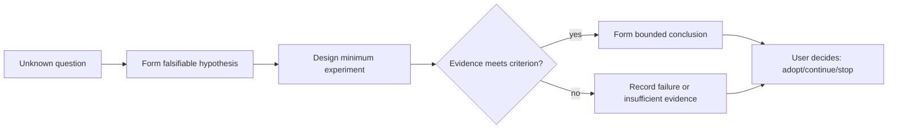

# Spike Validation Report

## Decision Summary

- Uncertainty reduced:
- Conclusion: feasible / conditionally feasible / infeasible / insufficient evidence
- Most important evidence:
- Applicability boundary:
- Confirmation needed now:

## Metadata

- work-item-id:
- Spike:
- Owner:
- Time box:
- Status: active / ended / converted to formal work
- Last updated:
- Comparison baseline: initial edition, no comparison baseline / previous approved path + Git commit

## What Changed

| Change | Previous | Current | Reason | Impact |
| --- | --- | --- | --- | --- |
| Initial edition | None | Spike record | Validation started | Current spike |

## Reading Guide

- Decision maker: conclusion, evidence, applicability, and recommendation.
- Development: hypothesis, environment, steps, and technical limitations.
- QA: success/failure criteria, raw evidence, and unverified items.

## Validation Path

This diagram answers: how does an unknown become a reviewable conclusion through hypotheses, experiments, and evidence?

Key conclusions:

- A spike validates a defined hypothesis and does not expand into full production implementation.
- Conclusions trace to commands, data, screenshots, or logs.
- Experimental feasibility is not production readiness; applicability is explicit.

## Question, Hypothesis, and Criteria

| Hypothesis ID | Falsifiable hypothesis | Success criterion | Failure criterion | Time box |
| --- | --- | --- | --- | --- |
| `D-001` |  |  |  |  |

## Environment and Steps

- Code/version/commit:
- Environment, configuration, and data:
- Commands and steps:
- Temporary-file location and cleanup:

## Evidence

| Experiment | Observation | Raw evidence path | Reproducible | Limitation |
| --- | --- | --- | --- | --- |
|  |  |  |  |  |

## Conclusion, Risks, and Recommendation

- Conclusion and confidence:
- Applicable and non-applicable scope:
- Production gaps:
- Recommendation: requirements/design / continue spike / stop
- Keep or remove spike code and prototype:

## Traceability

| Object | Full reference | Document path or section |
| --- | --- | --- |
| Hypothesis/decision | `<work-item-id>/D-001` | Question, Hypothesis, and Criteria |
| Downstream formal document |  |  |

## Diagram Waiver

No waiver by default. After an explicit user request, record the user, waived validation-path diagram, and reason.

## Human Readability Check

| Gate | Result | Evidence or explanation |
| --- | --- | --- |
| `DOC-G01`, `DOC-G04` | pass / waived / blocked |  |
| `DOC-G05` through `DOC-G12` | pass / blocked |  |

## Human Confirmation and Next Step

- User decision on the conclusion:
- Unverified items:
- Next step:
- Boundary: a spike does not automatically authorize production implementation.
