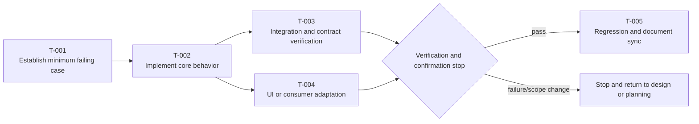

# Task Plan

## Decision Summary

- User-visible result for this batch:
- Task count and main modules:
- Scope allowed for continuous execution:
- Mandatory confirmation stops:
- Confirmation needed now:

## Metadata

- work-item-id:
- Feature:
- Owner:
- Status: draft / confirmed / in progress / complete
- Last updated:
- Comparison baseline: initial edition, no comparison baseline / previous approved path + Git commit
- Requirements, design, and API contract:

## What Changed

| Change | Previous | Current | Reason | Impact |
| --- | --- | --- | --- | --- |
| Initial edition | None | Task baseline | Design approved | Current work item |

## Reading Guide

- Business/product: read the delivery result, dependency graph, and confirmation stops.
- Development: continue with tasks, asset paths, dependencies, and continuous-execution policy.
- QA: focus on verification anchors, levels, regression, and completion evidence.

## Task Dependencies and Execution Stops

This diagram answers: which tasks are serial or parallel, and when must verification or user confirmation stop execution?

Key conclusions:

- Core behavior starts with a failing case or verification anchor.
- `T-003` and `T-004` run in parallel only when file and state boundaries are independent.
- Stop on verification failure, scope change, V3 risk, or a user confirmation point.

## Preconditions

- Requirements confirmed:
- Design confirmed:
- API/data model confirmed when applicable:
- Test strategy confirmed:
- Asset boundary config `.codex-workflow/asset-boundaries.json` confirmed:

## Data Source and Real API Integration Plan

- Development data source: Fixture / Mock / real API / mixed
- Current integration state: not started / `FIXTURE_READY` / `API_PENDING` / `CONDITIONAL_MERGED` / `API_INTEGRATED` / `QUALITY_PASS`
- Real API integration belongs to confirmed scope: no / yes
- Fixture/Mock exit condition and production-path isolation check:
- Real API integration task ID, environment, data range, and verification entrypoint:
- API unavailable evidence: not applicable / dependency, environment, time, and impact

Complete only after explicit conditional-merge approval:

- Approved by:
- Approved at:
- Source candidate and fingerprint:
- Target business branch:
- Approved scope and reason:
- Expiry condition:
- Compensating task:

`FIXTURE_READY` does not mean API integration complete; `CONDITIONAL_MERGED` does not mean acceptance or delivery. Keep real API integration and acceptance tasks open until `QUALITY_PASS`.

## Target Clients and Adaptation Boundary

| Target client | Covered by this batch | Allowed adaptation scope | Explicitly forbidden | Verification viewport/device |
| --- | --- | --- | --- | --- |
| PC Web |  |  |  |  |
| Mobile Web |  |  |  |  |
| iOS/Android App |  |  |  |  |
| Desktop client |  |  |  |  |
| Large display |  |  |  |  |

- Tasks cover only confirmed target clients. Do not adapt clients that are not explicitly supported.
- Tasks for responsive behavior, touch, mobile screenshots, and mobile E2E enter the plan only when requirements and design explicitly support mobile.

## Implementation Tasks

| ID | User/system result | File/module | Verification level | Continuous execution | Subagent | Minimum failing case/anchor | Chinese comment coverage | Document drift | Dependency |
| --- | --- | --- | --- | --- | --- | --- | --- | --- | --- |
| `T-001` |  |  | V0/V1/V2/V3 | continuous / cautious / must stop | none / implementation / investigation / review |  |  |  |  |

## Asset Placement Plan

| Task ID | Asset type | Full planned path | Allowed root | Forbidden root | Placement evidence | Gate result |
| --- | --- | --- | --- | --- | --- | --- |
| `T-001` | runtime / test / build / migration / document |  |  | `specs/`, `docs/`, or project-declared root | manifest / build or test config / project convention | pass / blocked |

## Verification Plan

| Test ID | Task/AC | Command or step | Expected result | Evidence path |
| --- | --- | --- | --- | --- |
| `TC-001` | `<work-item-id>/T-001` |  |  |  |

Levels: V0 document or no behavior change; V1 low-risk single point; V2 standard feature or ordinary bugfix; V3 production, permission, security, data, performance, money, cross-system, or hotfix work.

## Continuous Execution and Stop Conditions

| Task scope | Continuous | Stop condition | User authorization |
| --- | --- | --- | --- |
|  |  | scope change / verification failure / V3 / user confirmation / local resource anomaly |  |

## Subagent Boundaries

| Task scope | Recommendation | Role | Allowed files | Forbidden work | Main-agent review |
| --- | --- | --- | --- | --- | --- |
|  | none / recommended / strongly recommended | implementation / investigation / spec / quality / test |  | shared state, same migration, and same contract cannot run in parallel | diff / verification / drift / risk |

## Document Drift and Chinese Code Comments

| Check | Affected | Update or comment location |
| --- | --- | --- |
| Requirements, ACs, rules, or calculations |  |  |
| Design, API, or data model |  |  |
| INDEX, entry, or public-document patch |  |  |
| Chinese comments for rules, formulas, mappings, exceptions, or performance |  |  |

## Adversarial Review Plan

| Risk | Scenario | Check | Test |
| --- | --- | --- | --- |
| extreme input / permission / concurrency / performance / UI rendering |  |  |  |

## Completion Evidence

- Commands run:
- Manual checks:
- Screenshots or logs:
- Known remaining risks:

## Traceability

| Object | Full reference | Document path or section |
| --- | --- | --- |
| Task | `<work-item-id>/T-001` | Implementation Tasks |
| AC | `<work-item-id>/AC-001` |  |
| Test | `<work-item-id>/TC-001` | Verification Plan |

## Diagram Waiver

No waiver by default. After an explicit user request, record the user, waived dependency graph, and reason.

## Human Readability Check

| Gate | Result | Evidence or explanation |
| --- | --- | --- |
| `DOC-G01`, `DOC-G04` | pass / waived / blocked |  |
| `DOC-G05` through `DOC-G12` | pass / blocked |  |

## Human Confirmation and Next Step

- Tasks, dependencies, verification, and stop conditions confirmed: no / yes
- Continuous-execution authorization: not granted / authorized scope
- Recommended next step: continue planning / `company-implementation-runner`
- Phase boundary: plan confirmation does not automatically authorize coding; record explicit user authorization.
