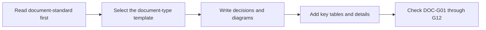

# Project Context Index

Start here before using any company workflow.

## Project Snapshot

- Product:
- Current version:
- Current milestone:
- Primary stack:
- Package manager:
- Test command:
- Build command:
- Local run command:
- Progress document: `说明文档.md` or equivalent

## Target Client Baseline

“Client” here means the user-facing product form, not TCP/HTTP network ports.

| Target client | Support status | Shared page/code/API | Viewport, browser, and input | Responsive/touch requirement |
| --- | --- | --- | --- | --- |
| PC Web | Needs confirmation |  |  |  |
| Mobile Web | Needs confirmation |  |  |  |
| iOS/Android App | Needs confirmation |  |  |  |
| Desktop client | Needs confirmation |  |  |  |
| Large display | Needs confirmation |  |  |  |

- Unconfirmed clients are unsupported by default; do not expand adaptation, interaction, or test scope from them.
- UI features inherit this baseline. A feature exception must be explicit in requirements and confirmed by the user.
- A PC-only product names its minimum viewport, browser, and input method. A non-UI feature may state “no direct client difference.”

## Routing

- Current feature specs:
- Current version directory:
- Current milestone directory:
- API contracts:
- Test locations:
- Main source entrypoints:

## Asset Placement Gate

- Configuration: `.codex-workflow/asset-boundaries.json`
- Confirmation status: needs confirmation
- Engineering asset roots: needs confirmation
- Requirements, design, and task plans name complete repository-relative output paths; implementation checks planned paths before editing; closeout checks changed files.
- After automatic generation, the project owner confirms engineering roots and exceptions. Do not treat inferred boundaries as formal project constraints before confirmation.

## Document Ownership Map

| Document | Role | Update trigger | Numbering namespace |
| --- | --- | --- | --- |
| `说明文档.md` or equivalent entry page | Project entry, current state, recent important events, reading route | Current phase, recent important event, reading route, or key status change | Do not use spike task IDs; use date-based project events or recent changes |
| `spike_*_工作日志.md` or spike-local log | Spike field log, experiment flow, temporary conclusions | Spike experiment, observation, decision, or temporary task change | `SPKxx-T001` or `Sxx-001` |
| `specs/versions/...` or `specs/features/...` | Formal requirements, design, task plan, acceptance basis | Requirements, design, tasks, acceptance criteria, or approved changes are confirmed | Feature, version, or formal task IDs |
| `business-rules.md` or equivalent business-rules document | Operation logic, state transitions, formulas, field semantics, exception handling, and example cases | Requirements trigger complex business rules, calculation semantics, or state transitions | Feature, version, or formal task IDs |
| `docs/lifecycle/` | Lifecycle phase summaries and milestone retrospectives | Version phase completion, milestone change, or management-summary need | Date or version-phase IDs |
| `docs/public-doc-updates/` | Public document impact patches for parallel branches | A branch affects the entry page, current state, reading route, document ownership, or numbering rules before mainline merge | Branch name, feature ID, or PR ID |

## Multi-Branch Public Document Protocol

- Public documents represent mainline facts; feature, spike, and hotfix branches read `说明文档.md` and this index by default.
- Before a branch is merged, do not write branch-local progress as the project "current state".
- When a branch needs to change public entry or index content, write `docs/public-doc-updates/<branch-or-feature>.md` first.
- During integration, promote only merged facts into `说明文档.md` and this index.
- If multiple branches affect the same public section, rewrite that section once on the integration branch.

## Numbering Rules

- Documents at different levels must not share bare IDs such as `Task 001`.
- Spike-internal tasks use a spike namespace, for example `SPK02-T183`.
- Formal tasks use feature, version, or formal task IDs, for example `FEAT-DT-T01`.
- Project entry pages record "project events" or "recent changes"; they do not continue spike work-log IDs.
- If numbering conflicts appear, fix the document ownership map before writing more content.

## Workflow Documents

| Need | Template |
| --- | --- |
| Formal document reading and quality standard | `specs/global/assets/document-standard.md` |
| Feature requirements | `specs/global/assets/requirements-template.md` |
| Data model and table design | `specs/global/assets/data-model-template.md` |
| Business rules and calculation semantics | `specs/global/assets/business-rules-template.md` |
| Technical design | `specs/global/assets/design-template.md` |
| API contract | `specs/global/assets/api-contract-template.md` |
| Task plan | `specs/global/assets/tasks-template.md` |
| Spike report | `specs/global/assets/spike-report-template.md` |
| Hotfix report | `specs/global/assets/hotfix-report-template.md` |
| Requirements prototype approval record | `specs/global/assets/requirements-prototype-record-template.md` |
| Independent quality validation report | `specs/global/assets/quality-validation-report-template.md` |
| Delivery closeout report | `specs/global/assets/delivery-closeout-template.md` |
| Change request | `specs/global/assets/change-request-template.md` |
| Public doc update patch | `specs/global/assets/public-doc-update-template.md` |
| Skill upgrade report | `specs/global/assets/skill-upgrade-report-template.md` |
| Workflow health report | `specs/global/assets/workflow-health-report-template.md` |

## Active Risks

- Asset placement configuration has not been confirmed.
